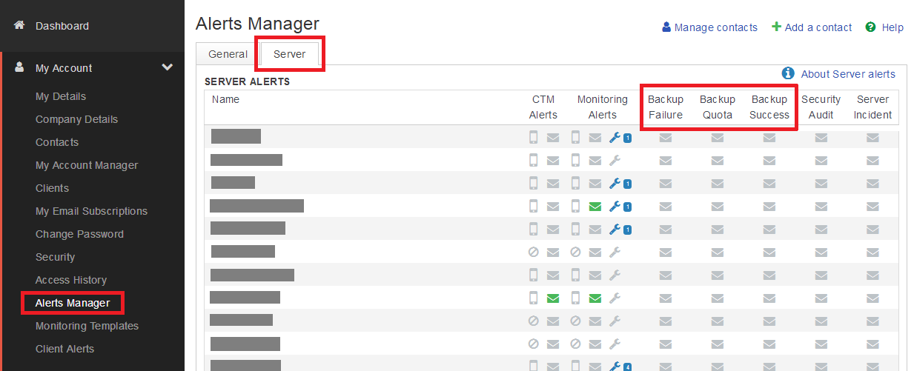
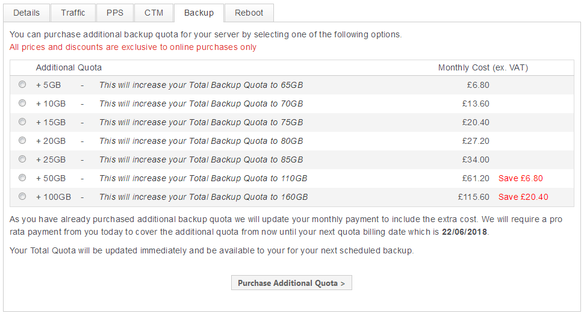

# Frequently Asked Questions

## How do I configure alerts for ANS Backup?

Alerts can be set up in the event of a backup failure, backup quota is reached or backup is successful.

You can set up and configure alerts for ANS Backup within ANS Glass. To do this, open the `My Account` menu and select `Alerts Manager`. Within this window, select the `Server` tab and activate email alerts for the contacts you require.

## How do I purchase additional quota for ANS Backup?

Additional quota can be purchased by contacting your Account Manager or through ANS Glass.

Navigate to your server backup control panel within ANS Glass and select `Purchase Additional Quota >` at the top of the page. This will take you to a screen where you can select the amount of additional quota you require (up to a maximum of 300GB) and allow you to complete the purchase online.
