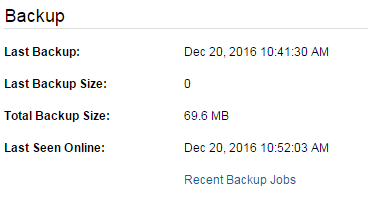

# Restoring files & folders from a backup

Restoring from a backup is a simple process. Find the files and/or folders you wish to restore as described in the [Managing Files and Folders](../managing-files-and-folders/) section. Select the files or folders and click `Restore` at the top of the page.

To restore from a previous backup job, click on `Recent Backup Jobs` within the computer or server you wish to restore from.

Find the backup job in question from the list, click on the link and restore the files/folders as described above.

