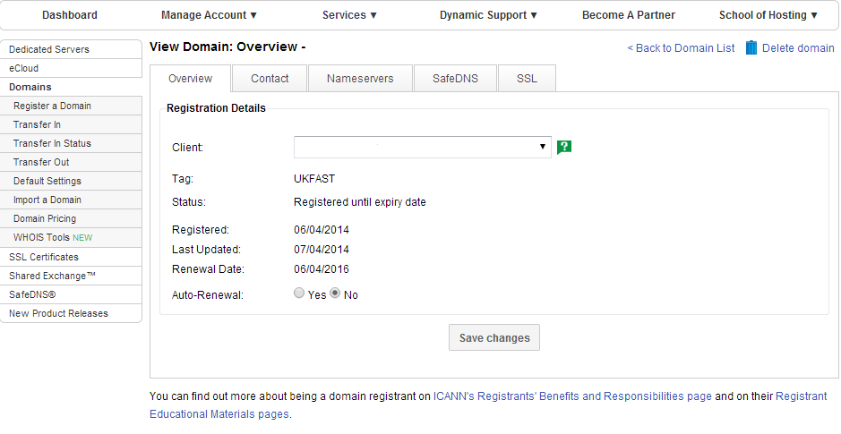
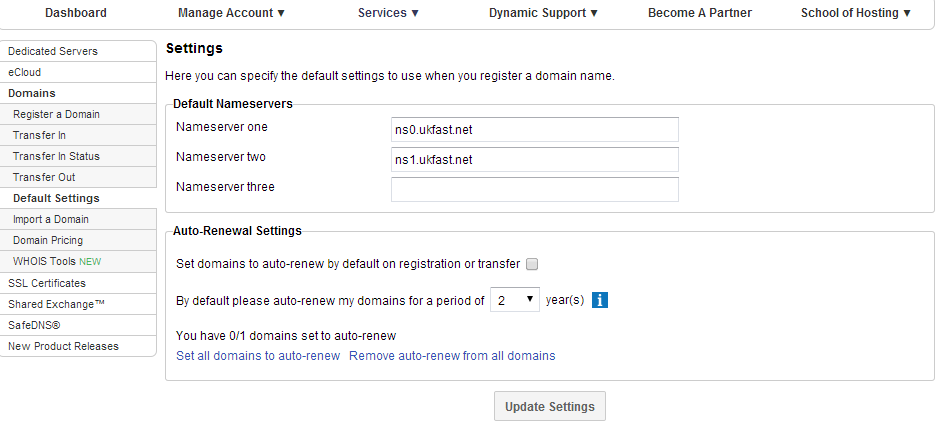

# How do I set my domains to auto renew?

Yes, you can do this by going into each domain individually from the `Domains` tab in ANS Glass.

Or, if you want to set multiple domains to auto renew, you can also tick as many as you want in the main `Domains` tab and select auto renew from the drop down menu at the bottom.

Alternatively, on the `Default Settings` page select the option to set all your domains to auto renew, and how long you want to auto renew them for.

There is also the option to default any domains you renew or transfer in to auto renew.
