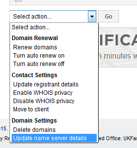
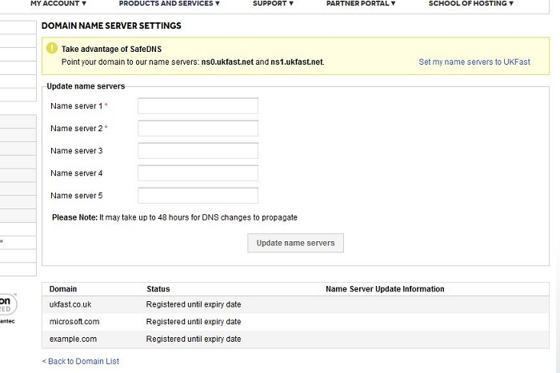

# How do I update the name servers on a domain?

To update the name servers on a domain navigate to `ANS Glass` > `Products and Services` > `Domains`.

Then select the domain that you wish to update, and under the name servers tab you will be able to amend the name servers information.

Please note that nameservers must be set to a hostname (e.g. `ns0.ukfast.net`), and that the domain must be managed by ANS in order to make any changes.

To update several name servers at once, you can use our bulk update drop down option from the Index page.

Then you can fill in name server information for multiple domains at the same time.

