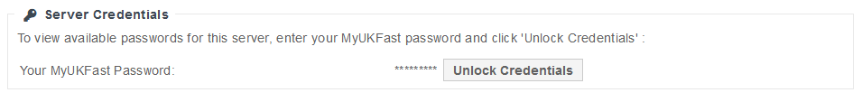

# Credentials

Once launched you can find credentials to your eCloud public VM by selecting the VM from the list in [ANS Portal](https://portal.ans.co.uk/ecloud-public). At the bottom of this page a section as shown below will be present.

After entering your ANS Portal password and selecting unlock credentials a list of all users ANS has on record will be presented.
