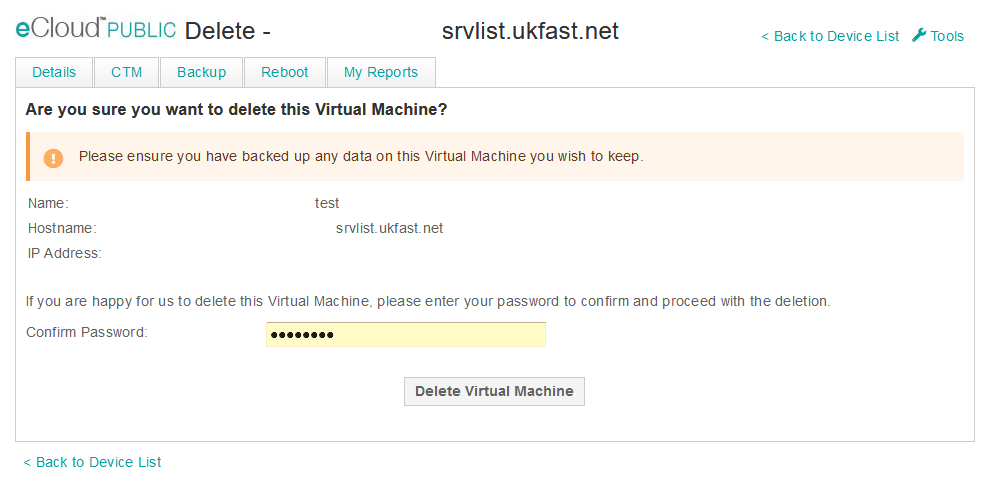

# Delete VM

If you need to delete the VM this can be actioned in [ANS Portal](https://portal.ans.co.uk/ecloud-public) using the delete option to the right of the VM entry as shown below.

After which you will then be asked for some quick feedback about your experience using eCloud public.
