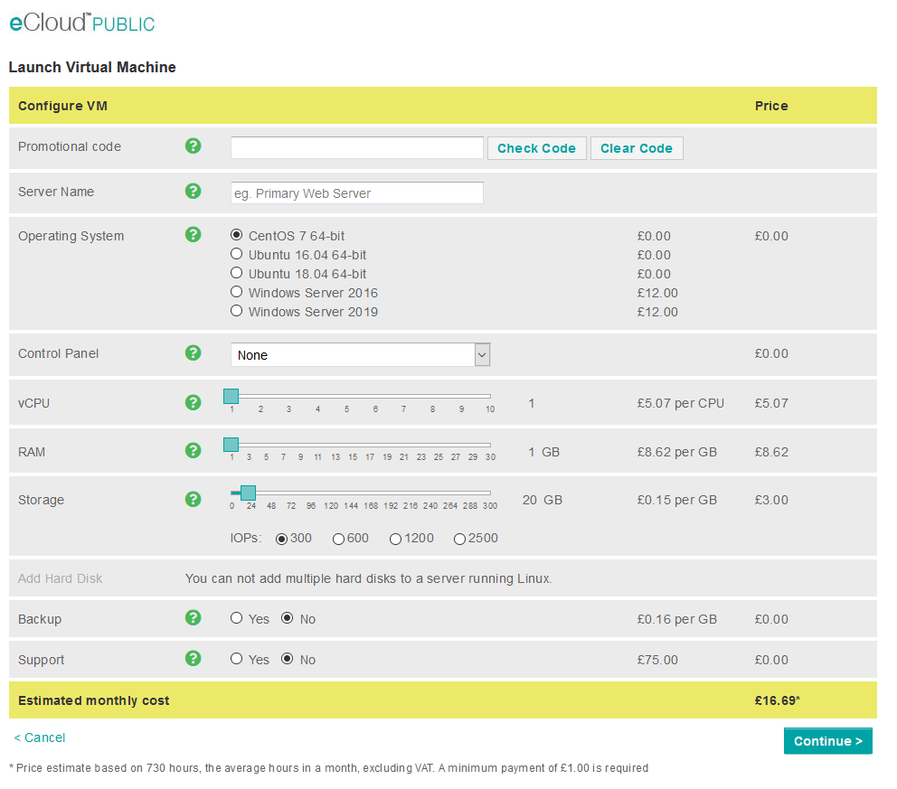

# Launch VM

A new eCloud public VM can be easily launched through [ANS Portal](https://portal.ans.co.uk/ecloud-public) by selecting launch VM. This will present the below configuration page in which you can specify the VM specification:

Here you will have options for the VM name, [operating system](/docs/operating-systems/), [control panel](/docs/operating-systems/linux/control-panels/), vCPU, RAM, storage, additional storage disks, VM level backups, support. Once you have the VM configured how you would like the continue button will confirm the specification allow you to change the billing cycle and then to complete the launch of the VM with the button on the bottom right.

Shortly after this will have ran through our automated launch process and you will be able to access your [new VM](https://portal.ans.co.uk/ecloud-public)
