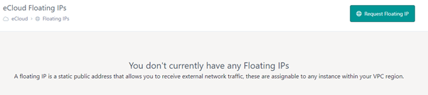
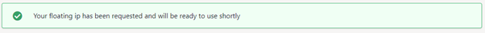
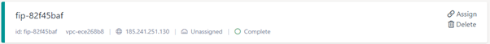
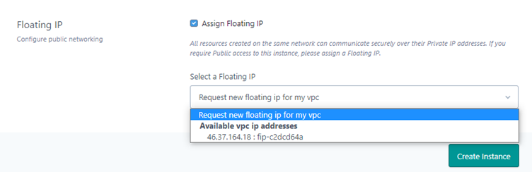

# Floating IPs

A Floating IP is public IP address that is used by a resource to route out to the internet

## How does a Floating IP work

You can add a floating IP to your VPC and not attach it to anything or you can attach it to a resource, by attaching it to a resource (e.g. an instance) then we create a NAT rule between the public and private address (of the resource you attached it to).

## Add a Floating IP to an Instance

There are two ways to add a floating IP to an instance;

To add an Floating (public) IP address to your VPC, press the Request Floating IP button. You can assign Floating IPs directly to Instances via the instance launch page

You should see the following banner whilst it deals with the request

With the IP then available, but not assigned to anything, remember that any floating IP that is not assigned to a resource will still be charged at the rate for that availability zone

When building your instance, you can then select from the available IPs;

## Delete a Floating IP

Press the trash icon on the floating IP card to delete it, it will only allow you to delete IPs that are not assigned to a resource.
