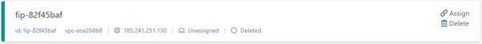

# Navigating eCloud VPC Control Panel

## Regions

An eCloud VPC region is an isolated and geographically separated area from other eCloud VPC regions.

Currently there are two; each of them currently has two availability zones available to create resources in. The regions are London & Manchester. When you land on the eCloud VPC page for the first time, the default region will be Manchester.

Regions are selectable from the top of the left hand menu, the default is ‘Manchester’.

## Availability Zones

Coming Q3 2021, availability zones will allow resources to be distributed into the same geographical area but with segregation of some networking and power.

## Resource Statuses

All of the resources within eCloud VPC have a status that can be one of the following four states:

Status Complete

The health of the resource is good

Status In Progress

The resource is currently being created, updated or deleted

Status Failed

The resource, for any number of reasons has failed to create, update or delete

Status Deleted

The resource has been successfully deleted and will not show after a refresh.

## Cards

Most resources we display are shown as ‘cards’ on ANS Portal, with their display name in bold on the top-left and then the most relevant information for that resource shown below. In this example of a floating IP it displays its name and then the id, the VPC it belongs to, the actual IP, where it is assigned to and its status. The card can be clicked to view further information and make changes to the resource.

