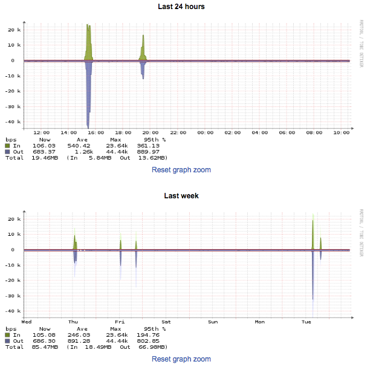

# Bandwidth usage

You can see bandwidth graphs showing traffic and packets per second (PPS) for most of your ANS-hosted servers, with the current exception of eCloud and eCloud Flex virtual machines.

Login to [ANS Glass](https://ans.glass) and go to `Dedicated Servers` via the `Products and Services` menu.

You will see a list of servers in your account. Find the server you want to look at, and click on either the `IP` or `Name`. When you're in the server go to the `Traffic` or `PPS` tab.

## Traffic

These graphs will show you the traffic that has been sent and received for this server over varying periods of time.

## PPS

These graphs will show you the packets per second that have been sent and received for this server over varying periods of time.

