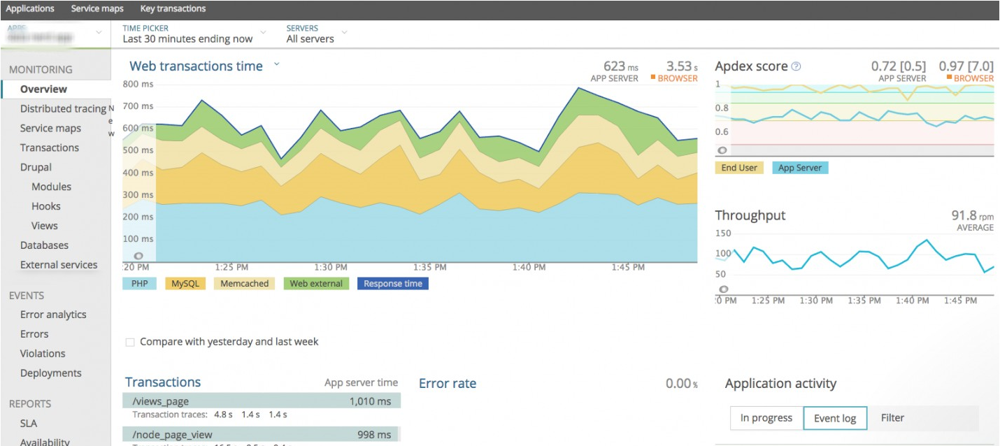
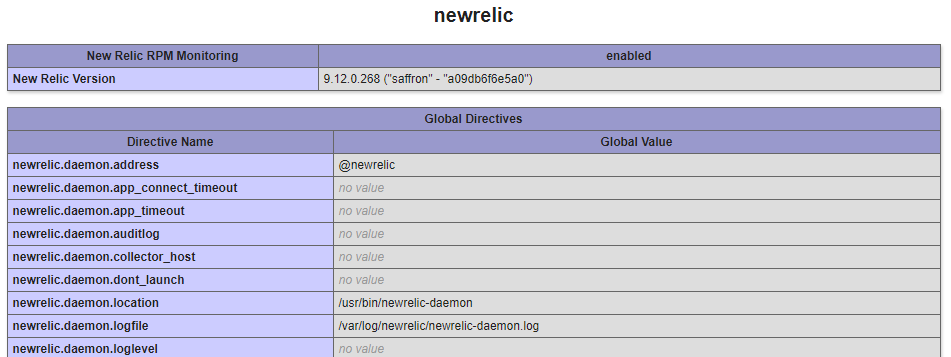
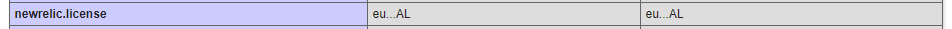

# How to install & configure New Relic on CentOS 7

In this article we will discuss how to install the `New Relic` PHP agent on a CentOS Server. `New Relic` is a third party developer tool that can provide in-depth application monitoring which can be used to identify problem areas in the application, commonly performance related.

`New Relic` offers a [free tier account](https://newrelic.com/signup/) with "100 GB/month of free data ingest" for users to take advantage of that doesn't require using credit card info.

:::tip
ANS support can assist with the installation of New Relic, but will not log into New Relic on your behalf to assist with any server/application troubleshooting.
:::

## Prerequisites

- License key
  - In order to install `New Relic`, you will need an **APM** [license key.](https://docs.newrelic.com/docs/accounts/install-new-relic/account-setup/license-key)
- PHP compatibility
  - `New Relic` supports popular frameworks and most new versions of PHP `7.2`, `7.3`, `7.4`, `8.0`, `8.1`, `8.2`, `8.3`, `8.4`.
  - More information on the supported frameworks can be found in the [New Relic documentation](https://docs.newrelic.com/docs/agents/php-agent/getting-started/php-agent-compatibility-requirements).

## Installing the agent

- Sign into your `New Relic` account, go to **Account Settings** and take a copy of your [**APM licence key**](https://docs.newrelic.com/docs/accounts/accounts-billing/account-setup/new-relic-license-key).

- Log into the server using SSH and run the following command to tell the package manager about the `New Relic` repository:

```
rpm -Uvh http://yum.newrelic.com/pub/newrelic/el5/x86_64/newrelic-repo-5-3.noarch.rpm
```

- Install the `New Relic` `Agent` and `Daemon` using the below command:

```
yum install newrelic-php5
```

- Next, run through the `New Relic` configuration script:

```
newrelic-install install
```

This is will prompt you for your **APM license Key** and detect your installed PHP version:

```
New Relic PHP Agent Installation (interactive mode)
===================================================

   Enter New Relic license key (or leave blank):
```

- Finally, restart the web service to start sending data to `New Relic`.

  - For `Apache` servers:

```
systemctl restart httpd
```

- If running `php-fpm`:

```
systemctl restart php-fpm
```

:::note
For Plesk/cPanel, you should confirm that you are restarting the correct web service - often, you can restart services within the control panel itself in Service Management/Manager.
:::

Once New Relic has captured enough traffic, log back into your New Relic account and data should start to appear in the **APM** tab.



### Installation on a server that is controlled by a panel (such as cPanel or Plesk)

If the server has a control panel, multiple PHP installations or the PHP binary is installed to an alternate location (e.g. `/opt`), then you will need to specify the PHP path with the following commands prior to running the `newrelic-install install` script.

#### cPanel example

```
NR_INSTALL_PHPLIST=/opt/cpanel/ea-php56/root/usr/bin:/opt/cpanel/ea-php71/root/usr/bin:/opt/cpanel/ea-php70/root/usr/bin:/opt/cpanel/ea-php73/root/usr/bin
export NR_INSTALL_PHPLIST
newrelic-install install
```

#### Plesk example

```
NR_INSTALL_PHPLIST=/opt/plesk/php/7.1/bin:/opt/plesk/php/7.2/bin:/opt/plesk/php/7.3/bin
export NR_INSTALL_PHPLIST
newrelic-install install
```

Please ensure that for either of the above examples that you remember to change PHP paths to suit your environment. For example, if you are on cPanel and using PHP 7.4, you will need to include the path to the PHP 7.4 binary using the same format as the provided example.

## Troubleshooting

If no data appears after 5 minutes make sure that you are generating some traffic to the website. `New Relic` will only display data it captures, if no traffic is hitting the website its possible the website may not have had any visitors yet.

If data is still not being produced after generating traffic to the website try the [Diagnostics tool](https://docs.newrelic.com/docs/using-new-relic/cross-product-functions/troubleshooting/new-relic-diagnostics) built by New Relic to identify issues.

To ensure the New Relic agent has been installed correctly, create a `phpinfo()` page in the websites document root.

For example:

```
vi /var/www/vhosts/example.com/public_html/info.php
```

```php
<?php phpinfo(); ?>
```

Now browse to `example.com/info.php`, if New Relic is installed correctly, you will see a section on New Relic.



Check that there is a valid license.



If the license shows as `***INVALID***`, run the `newrelic-install install` again and ensure that license key is valid and correct.

### Failure to connect to the New Relic Daemon

If you are unable to pull in data to the `New Relic` dashboard, you should first ensure that you have restarted the correct web service for your chosen website. Next, you will need to check the `New Relic` PHP agent log. This is located at:

```
/var/log/newrelic/php_agent.log
```

In this, you may see something like:

```
2022-09-22 11:44:26.796 +0100 (176494 176494) warning: daemon connect(fd=27 uds=/tmp/.newrelic.sock) returned -1
errno=ENOENT. Failed to connect to the newrelic-daemon. Please make sure that there is a properly configured
newrelic-daemon running. For additional assistance, please see:
https://newrelic.com/docs/php/newrelic-daemon-startup-modes
```

This can occur on servers with control panels where management and configurations of web services is non-standard. To remedy this, check for the following line in the `New Relic` PHP configuration `.ini` file for the PHP binary you are using.

```
grep daemon.port /etc/php.d/newrelic.ini
```

```ini
; Setting: newrelic.daemon.port
newrelic.daemon.port = "/tmp/.newrelic.sock"
```

In a text editor of your choice, amend this line to the following:

```ini
newrelic.daemon.port = "@newrelic-daemon"
```

Finally, terminate all existing `New Relic` daemon processes, and restart your web service, e.g.:

```
killall newrelic-daemon
systemctl restart php-fpm
```

Check back in the PHP agent log, and you should see that it has successfully started sending data for your chosen PHP version, e.g.:

```
2022-09-22 11:44:33.399 +0100 (182543 182543) info: New Relic 8.7.0.242 ("ȝelow" - "b9f00c7489f8") [daemon='@newrelic-daemon'
php='7.4.0' zts=no sapi='apache2handler' apache='2.4.6' mpm=prefork pid=182543 ppid=1 uid=0 euid=0 gid=0 egid=0 backtrace=yes
startup=agent os='Linux' rel='3.10.0-957.12.2.el7.x86_64' mach='x86_64' ver='#1 SMP Tue May 14 21' node='ukfast-server']
2019-06-11 11:44:33.400 +0100 (182543 182543) info: spawned daemon child pid=18254
```

:::note
If you require assistance with this install, simply give the UKFast Support Team a call, or raise a Priority Support Ticket and we'll be happy to advise/help. As noted, UKFast/ANS will not be able to log into your New Relic account on your behalf.
:::
