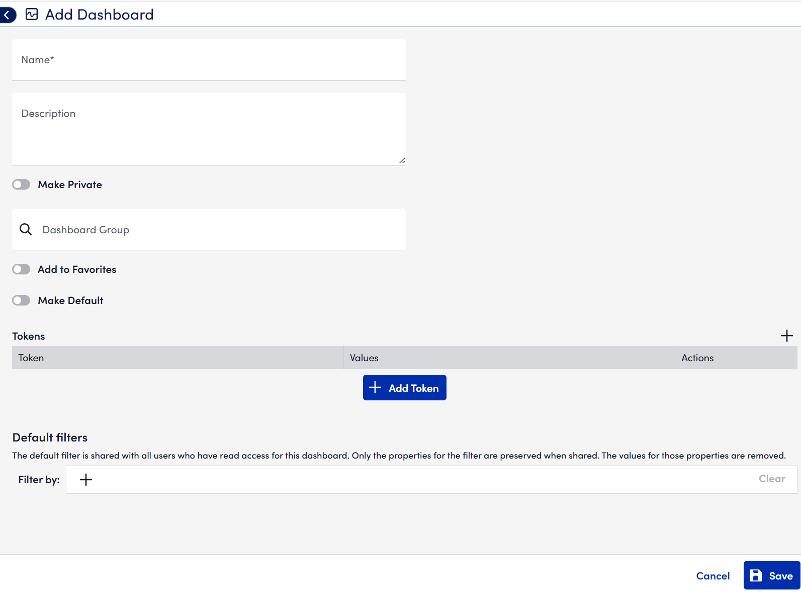
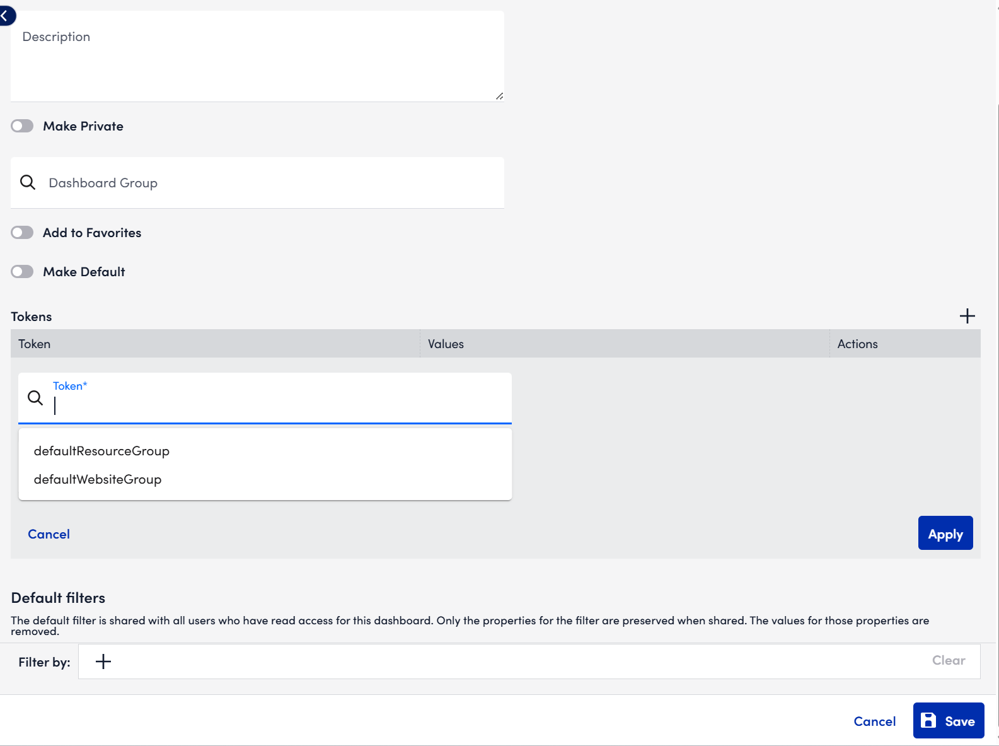

# Creating Dashboards in LogicMonitor

Dashboards enable you to create customised, strategic views of your systems, ensuring the data you need to manage your business is available at a glance.

## Create a new Dashboard

1. Select `Dashboard` from the primary left-hand navigation panel.
2. An `Open Panel` option will appear immediately to the right of this in the shape of an `>` symbol. Click `Open Panel` to display the `Dashboards` tree.
3. From the Dashboards tree, then select the `+` and then `Add Dashboard`.
4. The `Add Dashboard` dialog appears with several settings to configure.

## Name and description

Enter a `name` and `description` for the Dashboard.

:::note
Dashboard names cannot include the operators and comparison functions listed in the [Complex Datapoint](https://logicmonitor.com/support/logicmodules/datasources/datapoints/complex-datapoints/) support article.
:::

## Make Default

Toggle `Make Private` to make this the Dashboard that initially displays each time you open the `Dashboard` page.

:::note
If no default Dashboard is set for your user account, the Dashboard you most recently viewed will initially display when you open the Dashboard page.
:::

## Make Private

Check `Make Private` to make the Dashboard visible **only** to your user account. Private Dashboards are great for sketching or testing new widgets. The ability to create private Dashboards is governed by assigned roles.

If `Make Private` is **not** selected, the Dashboard is considered **public**. Public Dashboards intended for multiple users should remain public; availability for viewing and management is governed by assigned roles.

:::note
Administrators can view, add, and edit private Dashboards for all users. This enables creating Dashboards for internal/external customers and facilitates troubleshooting and overall Dashboard management.
:::

## Group

Use `Group` to assign the Dashboard to a Dashboard group:

- Start typing a group name to choose from suggested results.
- To create a **new** group, type the new group’s name and select it from suggestions.

**Why group Dashboards?**

- Review related Dashboards together.
- Simplify navigation when you have more than 10 Dashboards.
- Assign **view/manage** permissions by role.
- Improve navigation and quickly jump between functional areas, device types, or customers.

## Using Dashboard tokens

Dashboard tokens allow you to apply a single Dashboard template to different device or website groups by changing token values. This is useful for cloning common Dashboard setups across multiple end users or locations.

### Default tokens

Click the `+ Add Token` icon and place your cursor into the `Token` field to access default tokens.

- ##defaultResourceGroup##
  All widgets on this Dashboard will default to pulling from the **device group** set as this token’s value.  
  **Example:** This can be done with device groups such as (Windows_Devices), (Linux_Devices), etc., set the token value to (Windows_Devices) to show only (Windows Servers) device performance.

- ##defaultWebsiteGroup##
  All widgets on this Dashboard will default to pulling from the **website group** set as this token’s value.  
  **Example:** Set the token value to (Production_Websites) to show only (Production) website data.

:::tip
After saving a Dashboard with one or both default tokens, you can edit the Dashboard and enable:
**Overwrite existing Resource/Website Group fields with ##defaultResourceGroup## and/or ##defaultWebsiteGroup## tokens**.  
This replaces any pre-existing widget values with the default tokens—handy for templatising existing Dashboards for repeated use across customers or locations.
:::

### Custom tokens

Use the `+` icon to add `custom tokens`.

- Custom token **values** are free text (not lookups), so they can be any string.
- Primary use case: streamline input of new customer data after cloning a Dashboard.

**Example:**

- Devices are named via a standardised pattern: (DeviceName.server).
- Create a custom token: (##DeviceName##) with a value like (Devices).
- In a table widget’s **devices** field, use: (##DeviceName##.server).

After cloning the Dashboard for **Customer B**, change the token value (##CustomerName##) to (CustomerB) in **Manage Dashboard**. All references update automatically.

### Using tokens in widgets

Tokens defined in your dashboard’s **Manage** dialog act as **filters** for widgets:

- If (##defaultResourceGroup##) is set to a device group, only devices/resources in that group appear in the widget’s `Resource` lookup.
- When configuring a widget’s `Group`, `Resource`, `Resource DataSource`, or `Datapoint` fields, an `Insert Token` dropdown will list all tokens defined for the Dashboard.

:::warning
Token names are **case sensitive** when referenced in widget fields. Mismatched casing can cause widget errors.
:::
