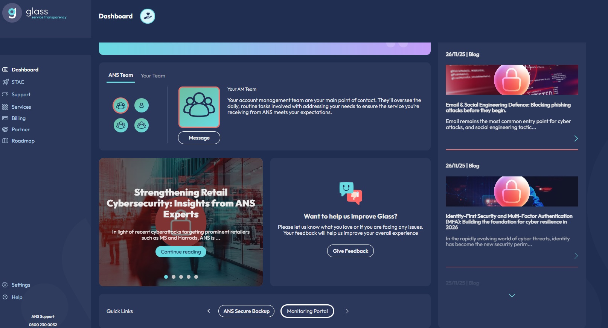
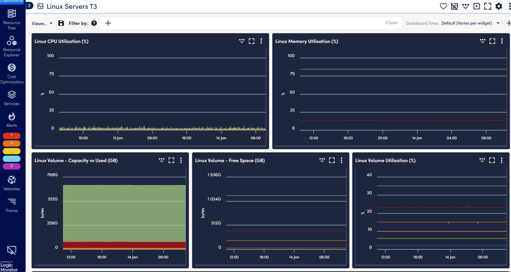
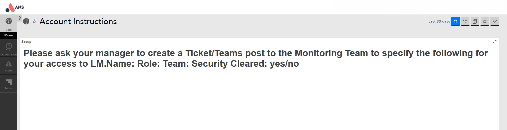

# How to access LogicMonitor from Glass?

Getting into LogicMonitor through Glass is quick and straightforward! Just follow the steps below.

## Login to Glass

Start by heading to the [Glass login page](https://ans.glass/).

Enter your usual login details to access your Glass dashboard.

Once you’re logged in, under Quick Links on your Glass dashboard you’ll see a link called `Monitoring Portal`.

This is your shortcut to LogicMonitor.

## You’ll be logged in automatically

After clicking the Monitoring Portal link, you’ll be taken straight into LogicMonitor.

No need to enter another username or password; Glass uses Single Sign-On (SSO) to log you in automatically.

If everything is set up correctly, you should see the LogicMonitor dashboard:

## If you see an access error

If you land on a page that looks like an error or says you don’t have access:

Don’t worry, this just means your LogicMonitor access isn’t set up yet.

Please reach out to your Account Manager (AM) or Customer Success Manager (CSM).

They’ll help get your access sorted quickly.

If you have any further queries please contact support.
