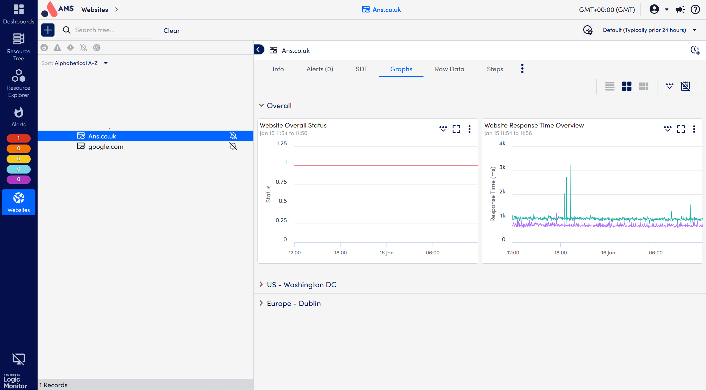

# Website monitoring in LogicMonitor

The Website monitoring page is separate from the Resources page, as shown in the screenshot below.

This page provides a clear overview of your websites current status. From here, you can view both the website status and response times in real time.

You can choose to see:

- **Combined status** — a summary view that merges results from all checkpoints monitoring your website.

- **Individual checkpoint details** — allowing you to review the status and response time from each specific checkpoint configured for your website.

This structure makes it easier to quickly identify issues, compare performance across locations, and troubleshoot any inconsistencies detected by the monitoring system.

If you have any further queries please contact support.
