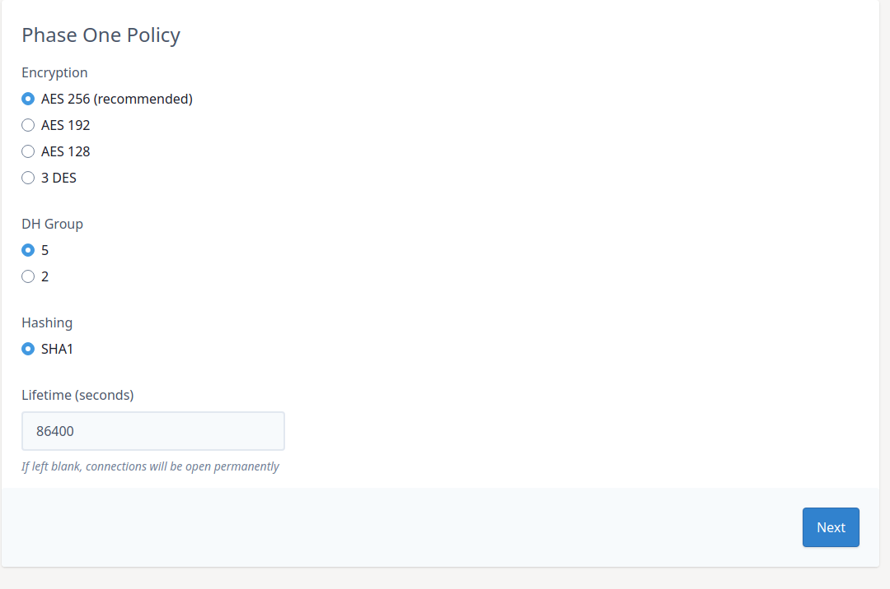
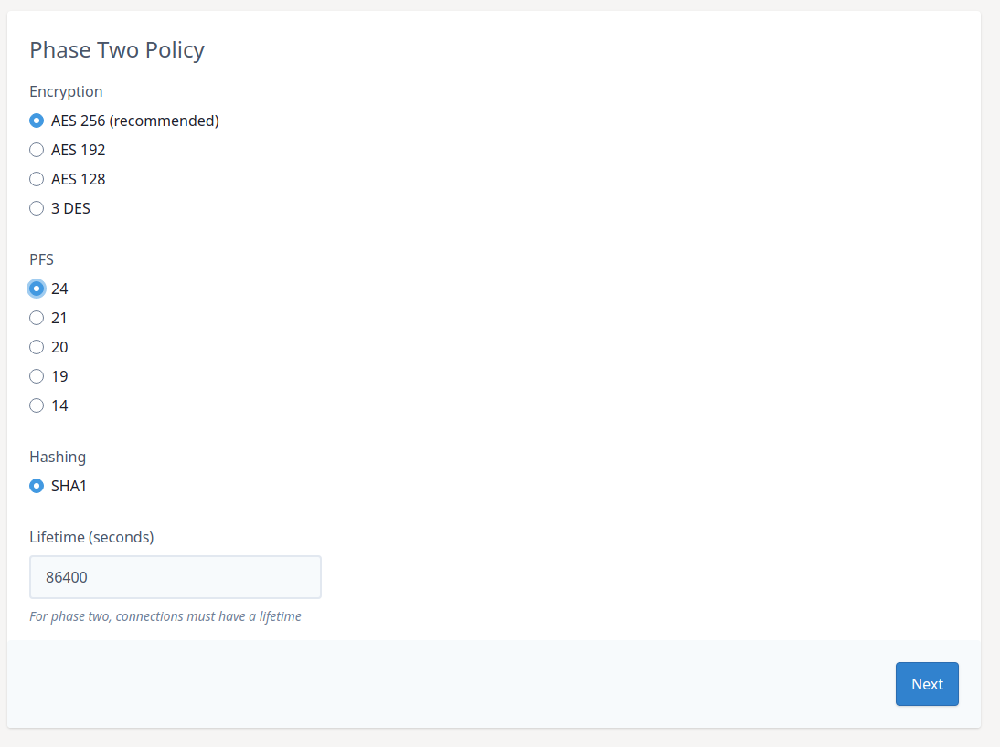
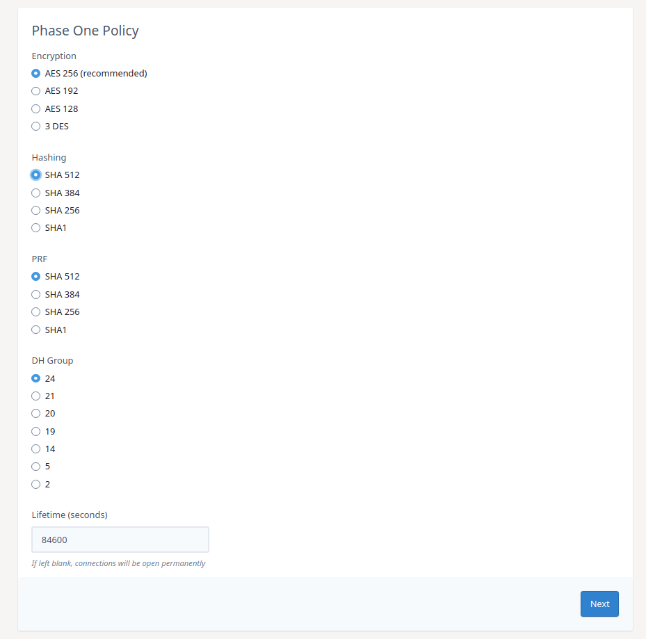
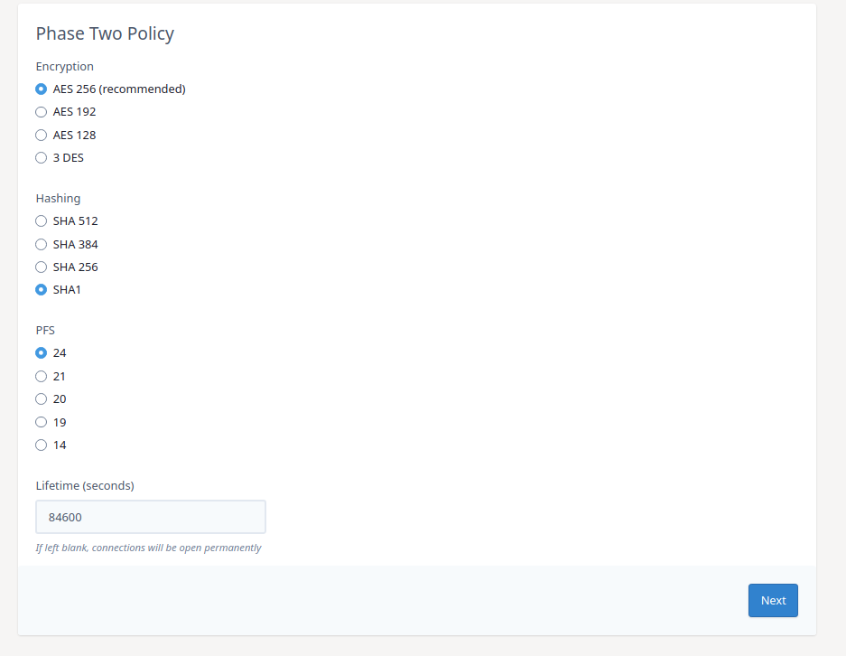

# Site To Site VPN dashboard

On the VPN tab of the editor, click the `Details` button on the **Site to Site** Section.

This screen displays information about the currently configured site-to-site VPNs on your firewall. There is also the option to create a site-to-site VPN by clicking the `Add New` button at the top of the page.

## Existing connections

You can see the peer IP and connection status for VPNs configured on the firewall. If the VPN is connected you can force a termination of the tunnel by clicking the `Rekey Connection` button. If you click
the `Edit` button you are then given the option to change the Peer IP and/or Pre-shared key in use on the tunnel.

Enter the peer IP and PSK into the boxes provided and click `Update`.

Please note, the change is not made to the firewall until you click `Apply Changes`.

## Creating a new Site to Site VPN

If you click the `Add New` button at the top of the page you can configure a new site-to-site VPN on your firewall.

### Required elements:

#### Name

Each VPN needs to have a unique name. This name is administrative and will be used to reference the VPN.

#### Peer IP

This is the public IP or the remote IPsec device where the VPN will be terminating.

#### PSK

This is the pre-shared key that will be used on both ends of the VPN to authenticate the tunnel at establishment.

#### Zones to be accessed

Please select which zones on your firewall you would like to be able to access over the VPN. This can be further restricted to individual servers by editing the access lists later.

#### Remote subnets

Please enter the remote subnets (encryption domains) that will be accessed over the VPN.

#### IKE version (IKEv2 is recommended)

Select the IKE version to be used on the VPN. This setting needs to match at both ends of the VPN as the version are not interoperable.

When these fields are completed please click `Next`.

### IKEv1 options

#### Phase 1

Select the required encryption, Diffie-Hellman group and hashing for Phase 1. This will need to match the settings on the remote end.

#### Phase 2

Select the required encryption, Diffie-Hellman group and hashing for Phase 2. This will need to match the settings on the remote end.

The next screen will be an overview of the VPN settings you have chosen, to send the config to the firewall click `Configure VPN`.

### IKEv2 options

#### Phase 1

Select the required encryption, Diffie-Hellman group and hashing and PRF value for Phase 1. This will need to match the settings on the remote end.

#### Phase 2

Select the required encryption, Diffie-Hellman group and hashing for Phase 2. This will need to match the settings on the remote end.

The next screen will be an overview of the VPN settings you have chosen, to send the config to the firewall click `Configure VPN`.

:::note
If you require assistance with this, simply give the ANS Support Team a call, or raise a Priority Support Ticket and we'll be happy to advise/help.
:::
