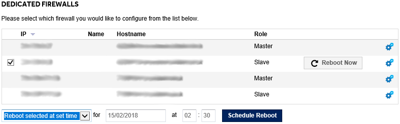

# Scheduling a dedicated firewall reboot

Firewall reboots should be managed through the dedicated firewall area in [ANS Glass](https://ans.glass).

Select the firewall that you would like to reboot and choose the time, then click `Schedule Reboot`.

## What if my firewall needs upgrading?

If you are running the Java-based ASDM to manage your firewall, or AnyConnect VPN with either SSL or IKEv2, your firewall needs updating.

Your ANS support team has uploaded the latest imaging software to resolve this bug. All you need to do is schedule your firewall to be restarted for this change to take effect. After this update is complete all functions will continue as normal.
