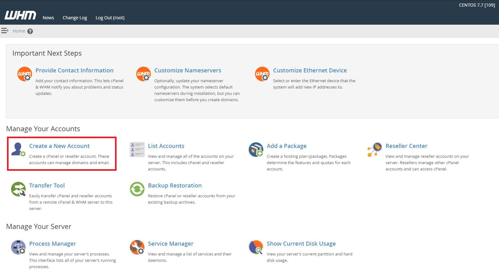
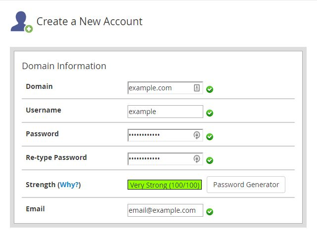
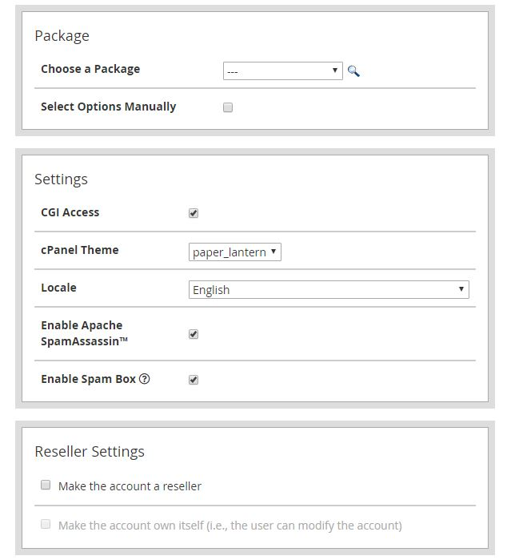
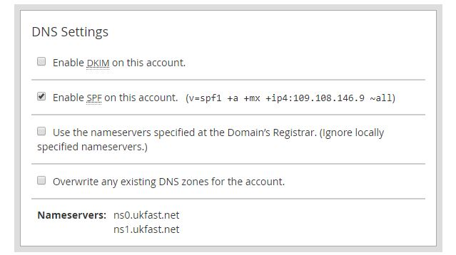
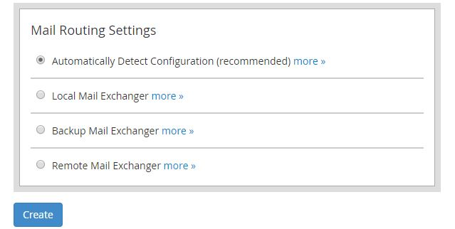

# How to add a new account in WHM

Once you've got your WHM server setup, you're going to want to add an account. In WHM, an account can be thought of as a catch-all term for a domain and associated resources. When you add an account, this creates:

- A `Virtual Host` for your domain.
- A `User` for FTP / SFTP / SSH administration
- A `Control Panel` for your domain, allowing for per user site administration (_email, subdomains, PHP settings etc._)

On the homepage of WHM, you will see a section called "Manage Your Accounts", and a "Create a New Account" button below that:

This will present you with a page to fill in information regarding the account that you're adding. The top section is "Domain Information". Fill in the relevant information for the account you're adding:

:::warning
Avoid adding a domain that is the same as the hostname of the server, as this will break many WHM services.
:::

The next three sections can be left as the defaults:

For the "DNS Settings" section, untick the box labelled "Enable DKIM on this account":

For the final section, "Mail Routing Settings", choose the automatic configuration option, then you can click "Create":

You've now added an account to WHM. You can now login, [using the guide here!](../cpanel-connect/#connecting-to-cpanel)
