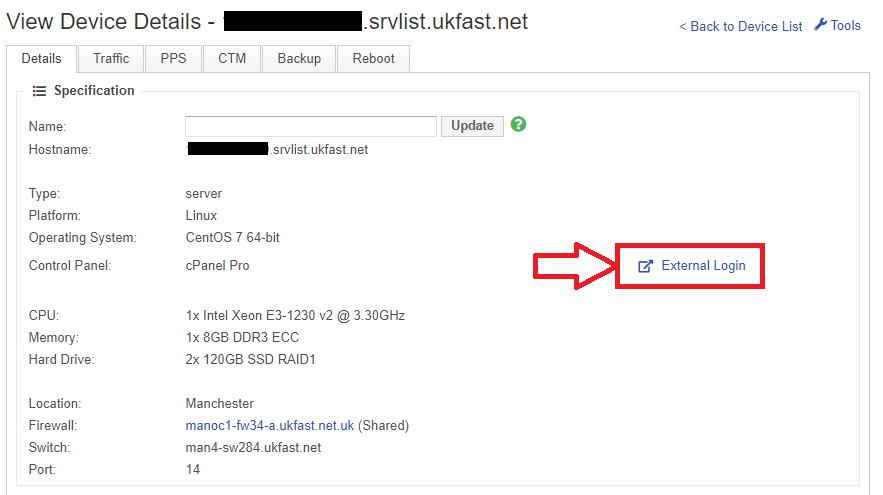
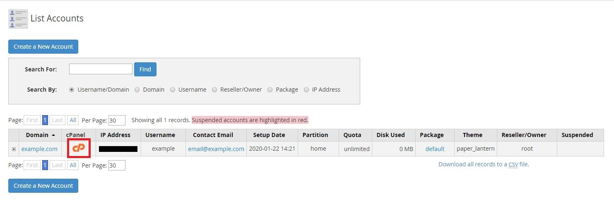

# How to log in to WHM and cPanel

There are 2 components to a cPanel server. There's WHM, which is the interface to manage reseller accounts. Then there is cPanel, which is the control panel for each account.

## Connecting to WHM

### Via ANS Glass link

First, log in to your ANS Glass area, and navigate to the server page.

In the top section of the page, you will see the "External Login" button. This will take you straight to the login page for WHM:



### Via URL

You can also connect to WHM, by appending `:2087` onto the hostname or IP of your server in a browser:

```none
https://IP.IP.IP.IP:2087
```

## Connecting to cPanel

### Via URL

There are 2 ways that you can connect to cPanel. The first is to append `:2083` onto the IP or hostname of your server in your browser:

```none
https://IP.IP.IP.IP:2083
```

### Via WHM

If you're logged into WHM, you can login to any of the cPanel accounts on that server. Login and navigate to:

```none
Account Information >> List Accounts >> "cPanel" Button
```


