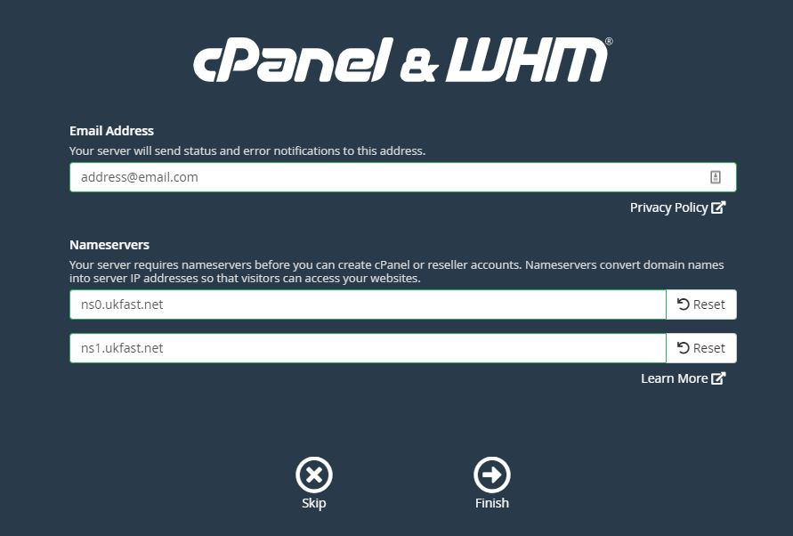

# WHM first time setup

When you first log in to WHM, you'll be presented with a page, asking for an email address, and 2 nameservers.

The email that you choose here will receive all of the maintenance updates from WHM, such as when there is an issue with the server, so ideally choose an account that is monitored often.

Unless you're using custom nameservers, you can use our SafeDNS nameservers here:

- `ns0.ukfast.net`
- `ns1.ukfast.net`

You're now ready to start using WHM/cPanel. [See our guide on adding accounts here!](../cpanel-add-account/)
