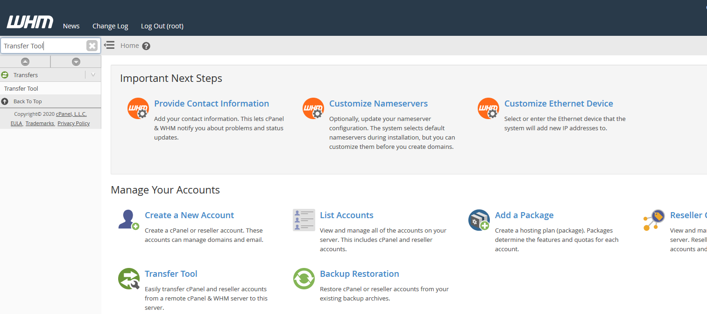
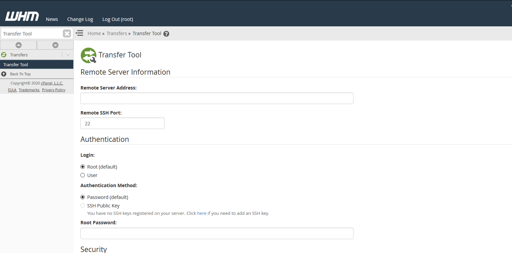
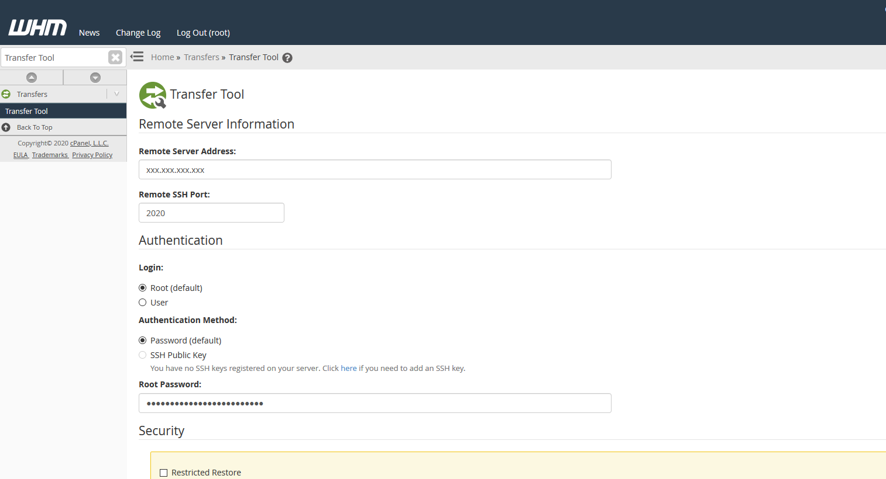
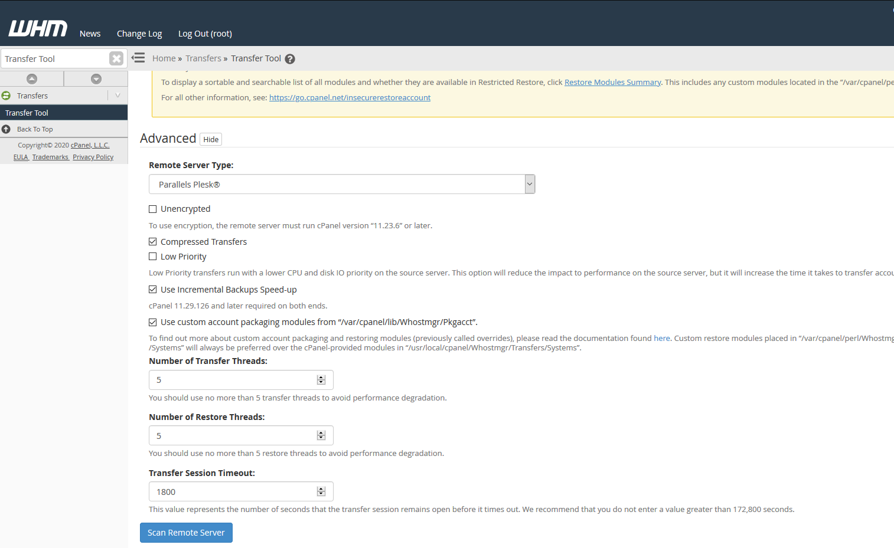
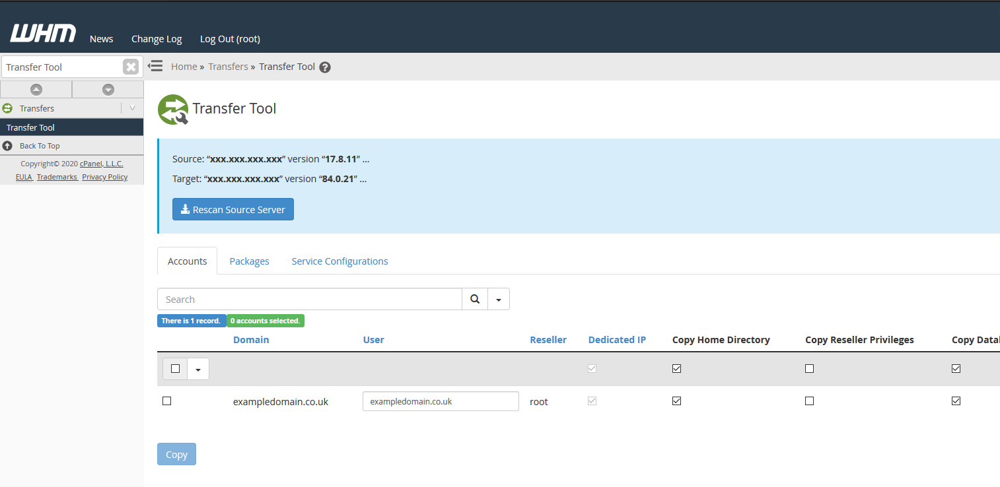
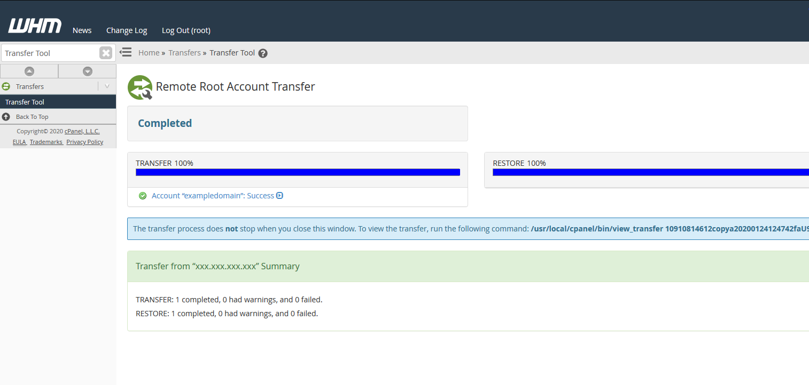
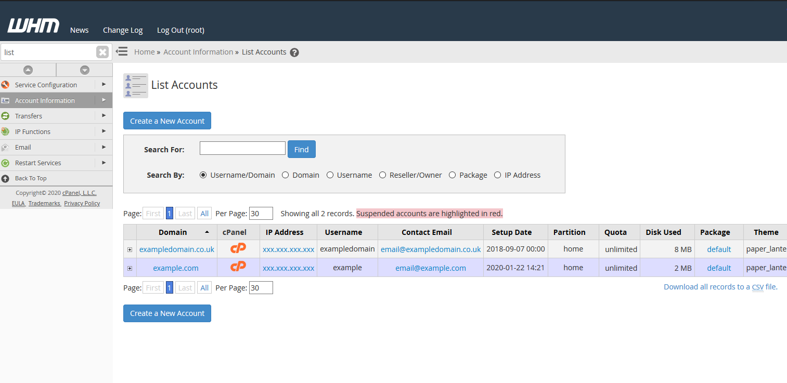

# Performing a Plesk to cPanel migration

A guide on performing a Plesk to cPanel migration.

:::note
cPanel requires the ability to connect to your Plesk server via your defined SSH port to complete any migrations
:::

To begin your migration you first need to ensure you are logged into your WHM panel.
The migration can only be started via WHM, which is the server-wide control panel, as opposed to cPanel which is the domain specific panel for your sites.

Once you are logged in to WHM, use the search box in the top left under the WHM logo to search for "Transfer Tool"
Click on "Transfer Tool" to be directed to the Transfer Tool page in which you can start your migration.

Now you are within the Transfer Tool section of WHM, fill in the details accordingly for the server you want to pull your data from.

- Remote Server Address: The IP Address of the other server.
- Remote SSH Port: The port SSH is bound to on the other server.
- Root Password: The password for the root user on the other server.

:::note
ANS Linux Servers listen on port 2020 for SSH by default.
:::

Once you have filled in the server details as per the above screenshot, scroll down and select the Remote Server Type as Plesk.
Next, click the "Scan Remote Server" button which will have the migration tool connect to the remote server and scan for migratable sites.

When the scan completes, select the sites you want to transfer to your server.
After selecting what you want to transfer over, click the "Copy" button to start the migration.

When the migration completes you will see the following page showing that both the transfer of data and restore of the account to your server is complete.

After the migration, you can go to the "List Accounts" page in WHM and you will be able to see the account you have just transferred.

You have successfully performed a Plesk to cPanel Migration!

Before amending your DNS to point to your new server, you can test your websites using a hosts file change.
