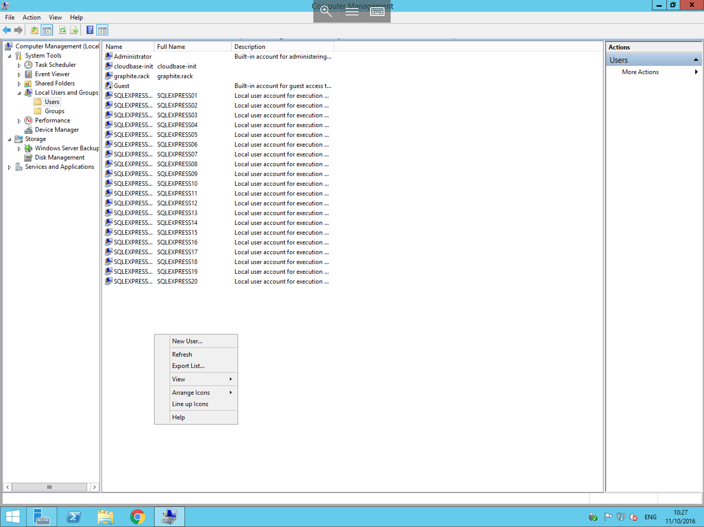
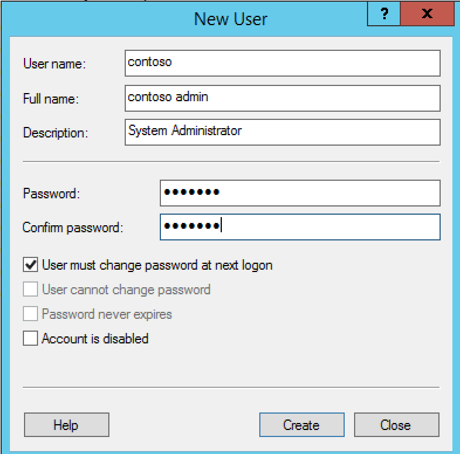

# Creating a new user in a Workgroup

To create a new user account on your server, please follow the below guide:

Open `Server Manager` from the Taskbar, select `Tools` and then select `Computer Management` as below:

Once the Computer Management console opens, you will see a selection of menu entries in the left hand field under the headings `System Tools`, `Storage`, and `Services and Applications`.
Pop out the arrow next to system tools, and pop out the arrow next to the newly visible `Local Users and Groups` menu item.

You should now be presented with 2 folders, one named `Users`, and the other named `Groups`, select the `Users` folder to view the current list of users on your server. Right click in any blank area of the central section of the computer management console as below and select `New User`.

You will now be presented with the new user context box, you will need to enter some basic information for your new account, including chosen user name, description and a password for the account.

Once you have entered the required information, click `OK` and your new user has now been created.
