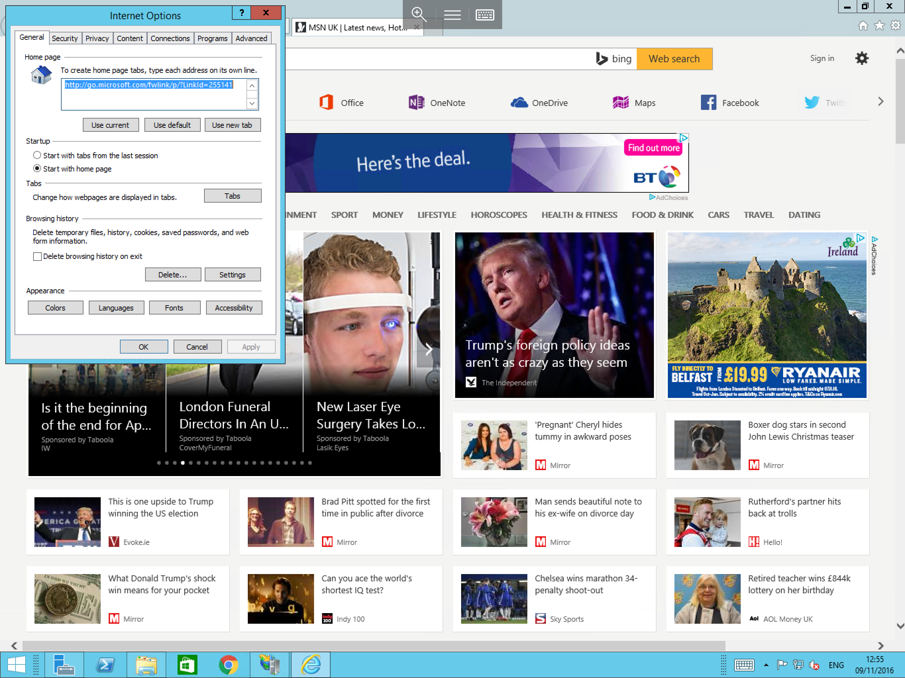
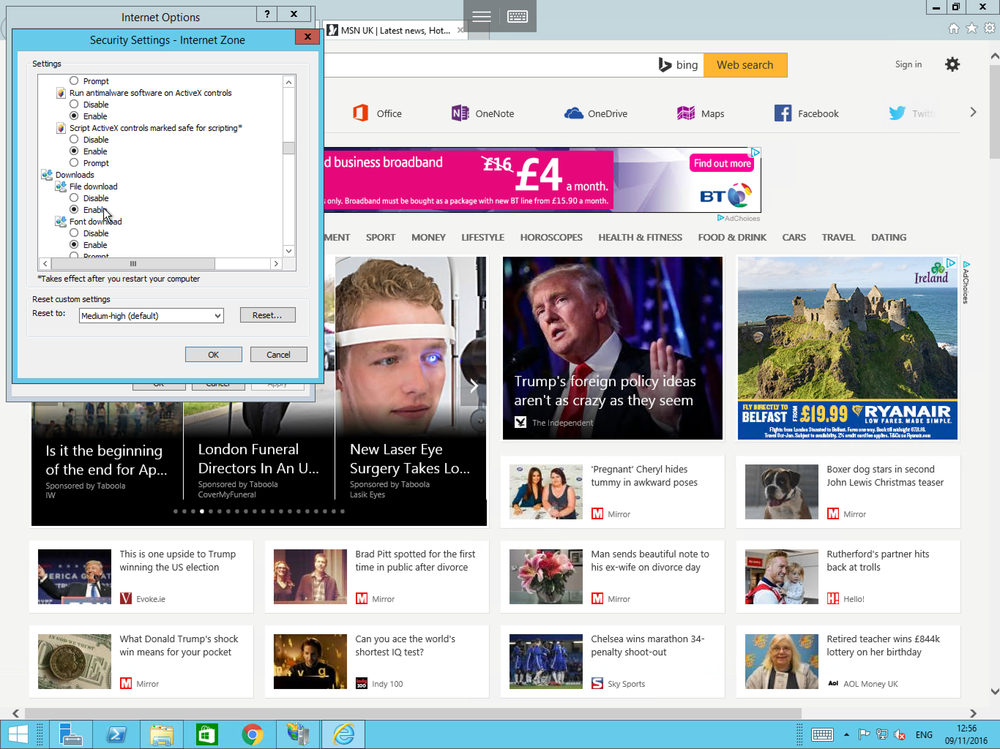

# How to enable file download in Internet Explorer on a Windows Server

In Windows Server 2008/2008R2 and Windows Server 2012/2012R2 file downloading in Internet Explorer is disabled by default for added security. To enable file downloads in Internet Explorer please follow the below guide.

## In Windows Server 2008/2008R2 & Windows Server 2012/2012R2

Open Internet Explorer using the taskbar icon, alternatively, you can open it by selecting start and selecting `Internet Explorer` from the list of available applications. Once opened, please select the Cog in the top right hand corner of the screen, and select `Internet Options` from the resulting context box, as below:

You will now be presented with the `Internet Options` `General` tab as below:

Select the `Security` tab along the top line, you will now see several zones across the top of the window as below. Please ensure that you have "internet" selected, and select `Custom level...`

The `Security Settings - Internet Zone` will now be presented, scroll down the list until you reach the `File download` option around a third of the way down the list and select `Enable` as below:

Select `OK` and attempt to download your required file.

## In Windows Server 2016

No Action is required in Windows Server 2016 as file downloads are enabled by default in Internet Explorer.
