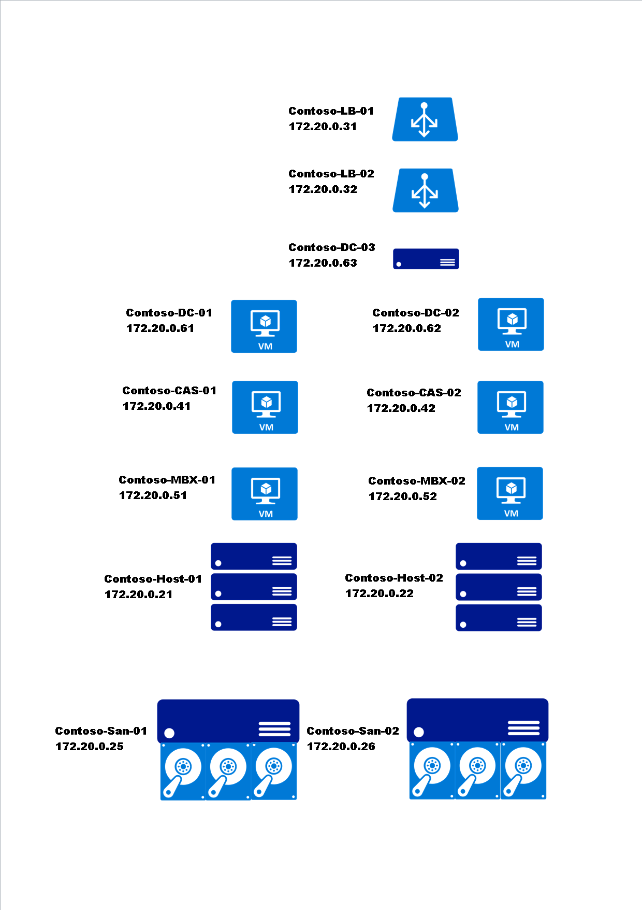
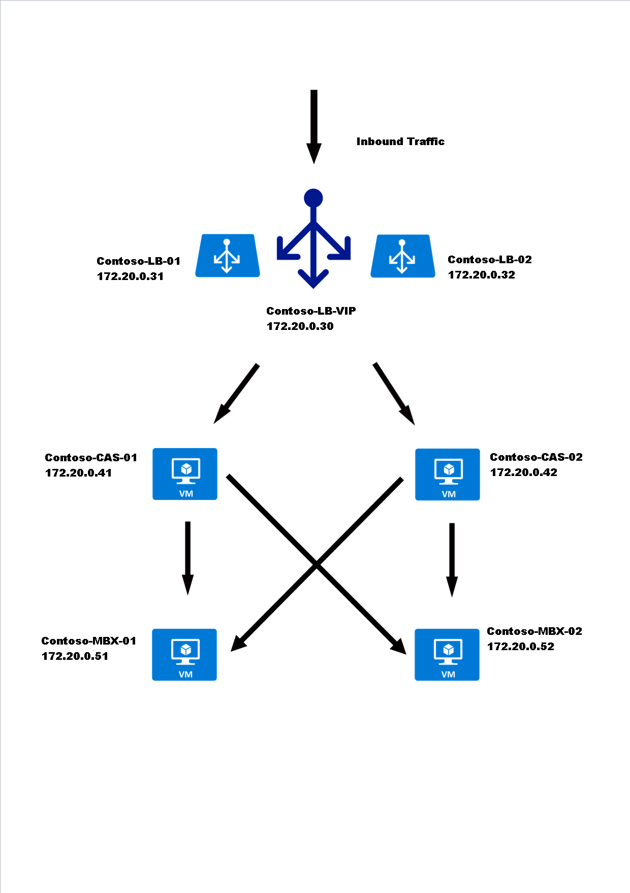

# Exchange 2013 multi-server environment

The two images below are Physical and Logical Solution diagrams which highlights the flow of mail in a Microsoft Exchange high availability solution.

## Physical structure

## Logical structure

