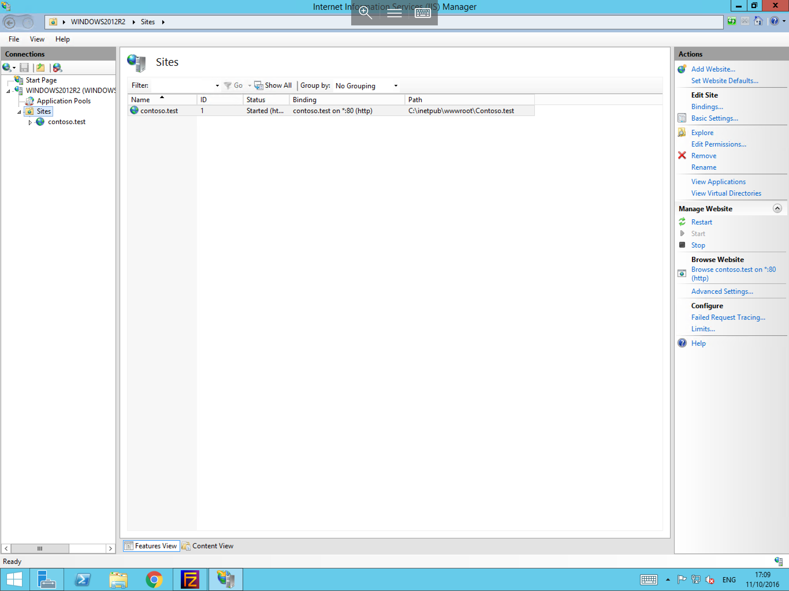
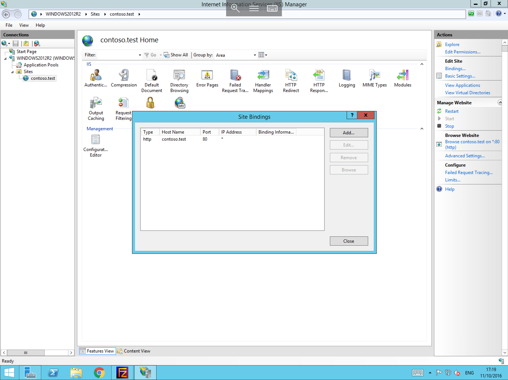
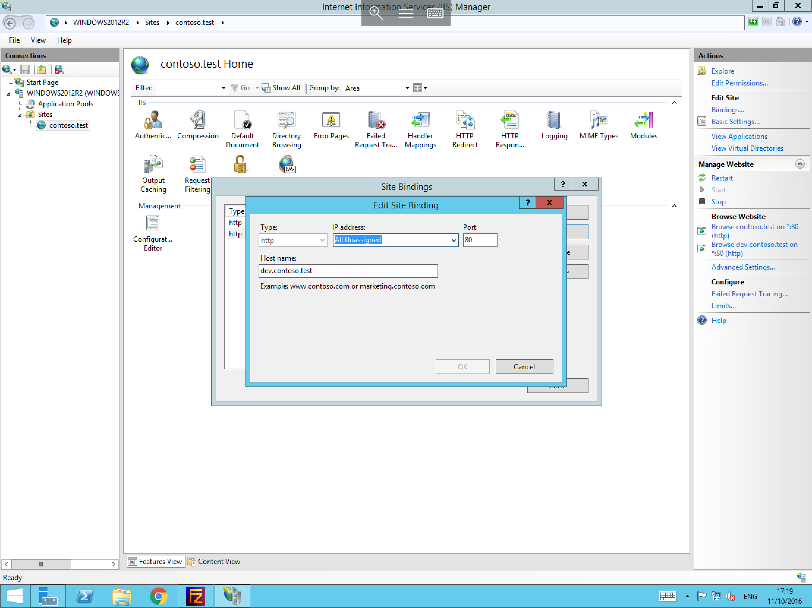
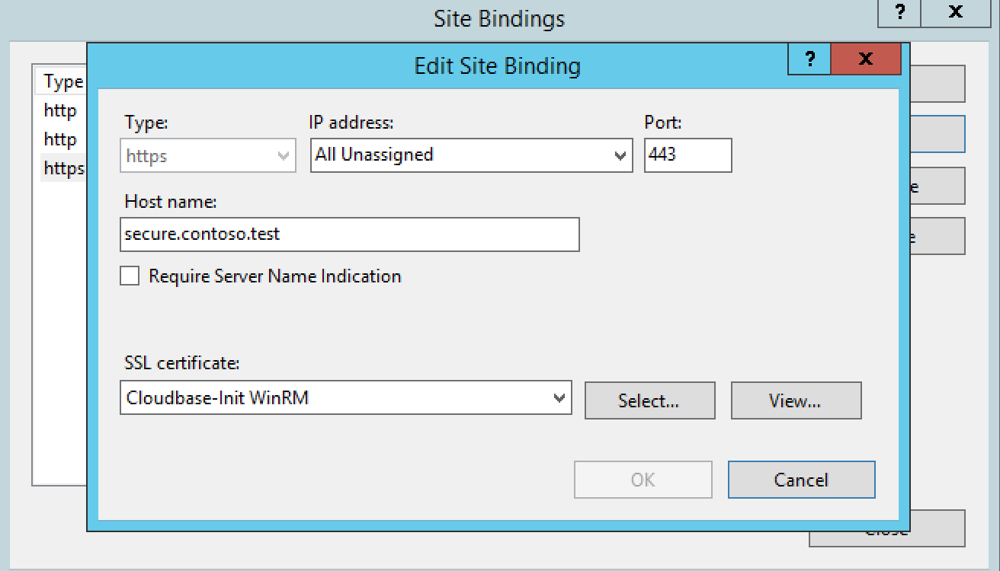
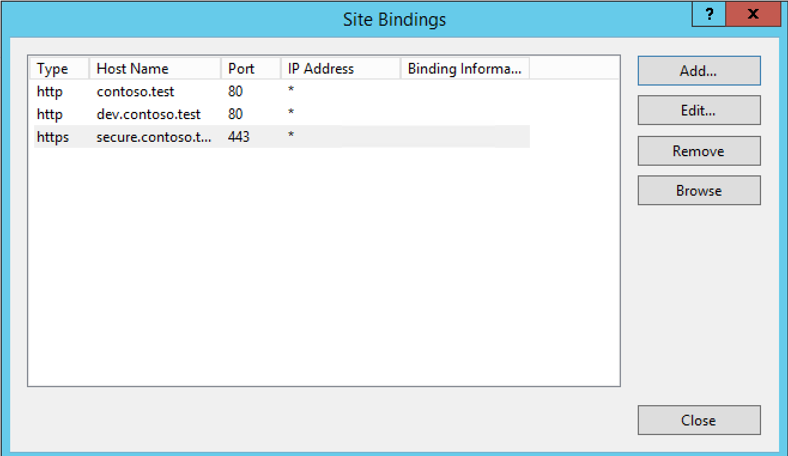

# Creating bindings

:::note
Please note, before creating bindings, you will first need to create a site within IIS. If you are unsure on how to do this, please review our guide [Setting up your first site in IIS](../first-site/).
:::

To create bindings for your new site, you will need to carry out the below steps:

- Within IIS, pop out the server instance within the connections pane on the left hand side of the window, then pop out the `Sites` menu, as below:

- Select your site, then select the `Bindings` button over to the right hand side, in the actions pane. You will now be presented with the `Site Bindings` menu, as below:

- Select the `Add` button from the available options, you will now be presented with the `Add Site Binding` context box, as below. Within this box, please select the type of traffic which you would like the binding to handle, i.e HTTP or HTTPS.

- Select the IP address and port which you would like the binding to listen for traffic on, and then enter your site's host name, for example `dev.contoso.com`.
  Once you are happy that all of the content is correct, please select the `OK` button to apply your binding.

- This process differs slightly if you choose to create a secure binding i.e an HTTPS binding. If you choose to create an HTTPS binding you will also be prompted to assign an installed SSL certificate to the binding to secure the site, as below:

- Once you have created all of the bindings which you require for your site, you will be presented with a list of bindings within the `Site Bindings` menu, which should look similar to below. Once you are happy that the list contains all required bindings, please select `Close`.

- Your bindings are now configured, and are ready to handle traffic once the relevant DNS records are in place.
