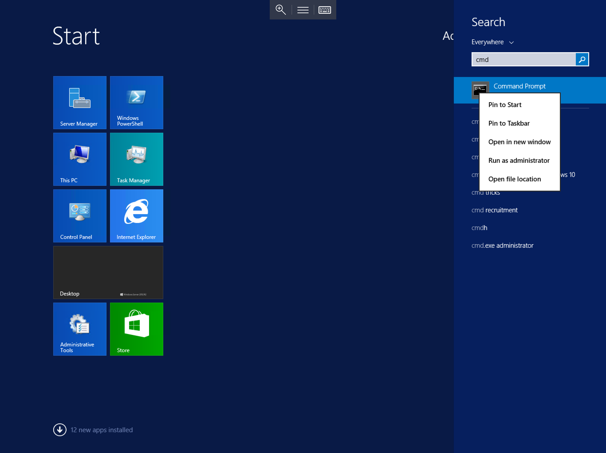
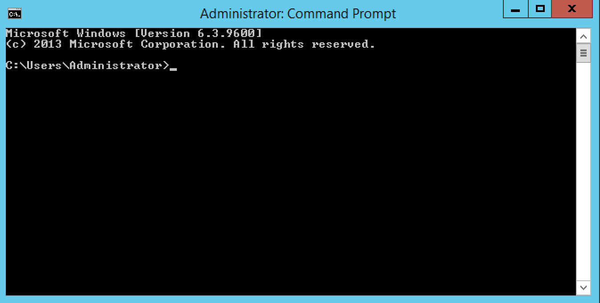
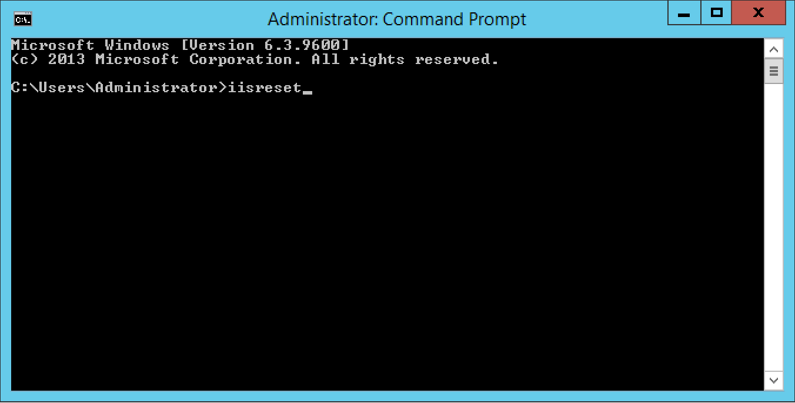
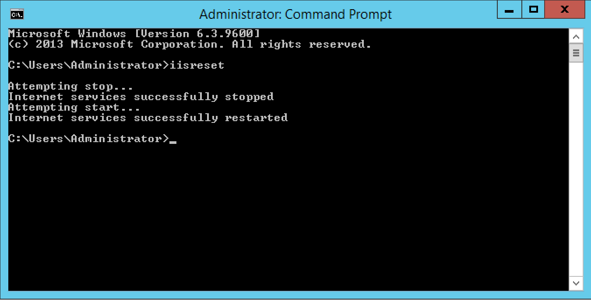

# How to reset IIS

IIS can sometimes require a restart to apply certain changes or to force-close connections to applications/websites.

:::note
Forcing an IIS reset will result in a short period of downtime for any websites on the server in question.
:::

In order to carry out an IIS reset please follow the below guide.

Select `Start`, type `cmd`, right click `Command Prompt` when it is displayed and select `Run as Administrator` as below:

You will now be presented with a new Command Prompt with administrator level access as below:

Within the command prompt, type `iisreset` as below. Press the `Enter` key.

The reset process will now begin, and the words "Attempting stop..." will be printed in the `Command Prompt` window. the process usually takes 5-10 seconds, however if the server is handling a large volume of connections at the time when you initiate an `iisreset`, the process can take considerably longer.

Once the process has completed, you will be given access to your Command Prompt once more as below.

IIS has now been restarted.
