# How to configure `X-Forwarded-For` (XFF) in IIS

If your solution makes use of a Layer-7 Load Balancer with multiple web backends, from the web servers all traffic will be logged as being from the load balancer. This can be a problem in several scenarios where you need to identify the source of traffic. The `X-Forwarded-For` header can be used to keep the source IP of inbound traffic, and then log the original IP in your logs.

Different versions of IIS have different procedures which need to be followed to enable `X-Forwarded-For`, please follow the appropriate section below.

## `X-Forwarded-For` in IIS 7 & 7.5

:::note
In order to utilise `X-Forwarded-For` in IIS 7 or 7.5, the `Advanced Logging` module will need to be installed. This can be downloaded from the link below:

- [IIS Advanced logging](https://www.microsoft.com/en-gb/download/details.aspx?id=7211)
  :::

Once you have downloaded the module, install it by following the simple wizard.

With the module installed, select `IIS` and select your site from the menu. Now in the `Features` view, you will see `Advanced Logging` as below. Select this module.

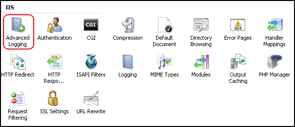

Once selected, select `Enable Advanced Logging` from the `Actions` pane to the right hand side of the window, as below.

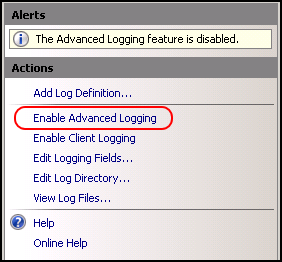

Then select `Edit Logging Fields` again from the actions pane as below.

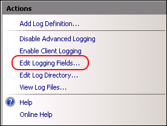

You will now be presented with the `Edit Logging Field` pane, select `Add Field`, and then add the following information:

- **Field ID**: ClientSourceIP
- **Category**: Default
- **Source type**: Request Header
- **Source name**: `X-Forwarded-For`

Once you have entered the above details, please select `OK` and you should be returned to the `Edit Logging Field` pane, which should now look like below. Select `OK`.

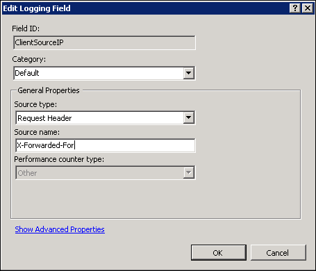

You will now be returned to the IIS window from the `Actions` pane. Select `Add Log Definition` as below.

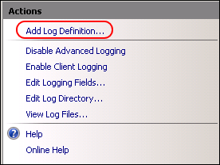

You will be presented with the `Log Definition` window, please enter "Client Source IP" in the `Base file name:` field as below and then select the `Select Fields...` button at the bottom of the window.

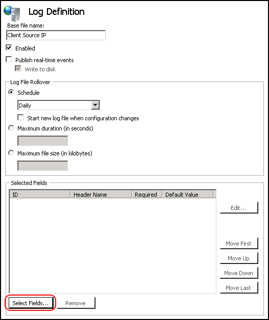

From the resulting `Select Logging Fields` window, please tick the `ClientSourceIP` ID from the list as below, and then select `OK` and select `Apply` from the `Actions` pane.

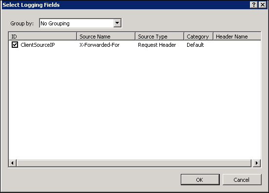

Select `Return To Advanced Logging` from the `Actions` pane.

To fully apply the advanced logging rules, you will need to carryout an [IIS Reset](../restart/) from an administrative Command Prompt. If you are unsure how to do this, please follow our guide here: [How to reset ISS](../restart/).

With an IIS restart having been completed, your advanced logging function should now be operational. To view the advanced logs, you can do so 2 ways:

1. Navigate to `C:\inetpub\logs\AdvancedLogs`.
2. Select the `Advanced Logging` module in IIS, right click on the `Client Source IP` rule, and select `View Log Files` as below.

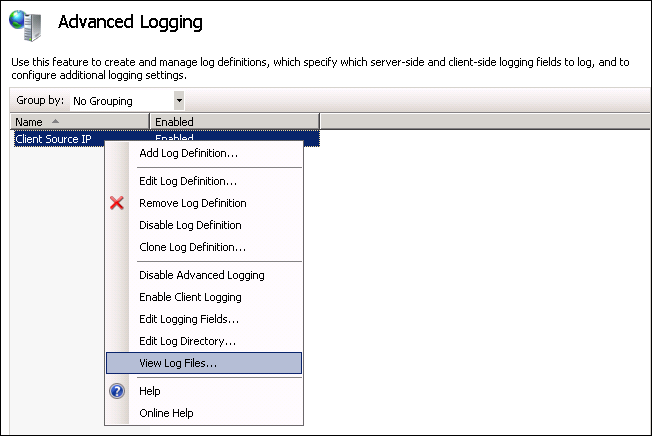

## `X-Forwarded-For` in IIS 8.5 and above

In older versions of IIS, the `Advanced Logging` had to be installed to support `X-Forwarded-For`, in IIS 8.5 this is not the case.
To configure `X-Forwarded-For` in IIS 8.5 or above, please follow the steps below.

Launch `Server Manager` by selecting `Start`. Selecting `Server Manager` from the list of available application, alternatively, select the `Server Manager` icon from the taskbar.

Within Server Manager, select `Tools` from the top section, and select `Internet Information Services (IIS)` from the resulting list as below.

You will now be presented with the `IIS Manager`. From the connection pane on the left hand side of the window, select your site (if you wish to have logging for specific sites) or select the server instance (if you wish to enable logging for all sites.) Once you have made your selection, select `Logging` from the `Feature` view in the centre of the window as below.

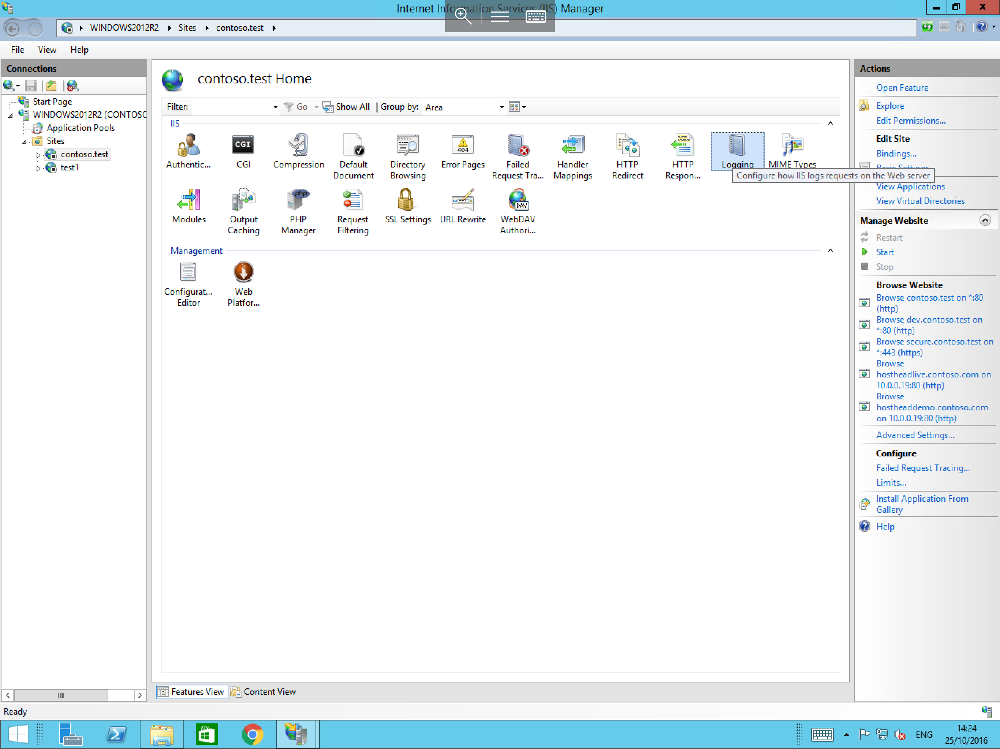

You will now be presented with the logging options. Under the `Log File` section, select format `W3C` and choose the `Select Fields...` button next to it as below.

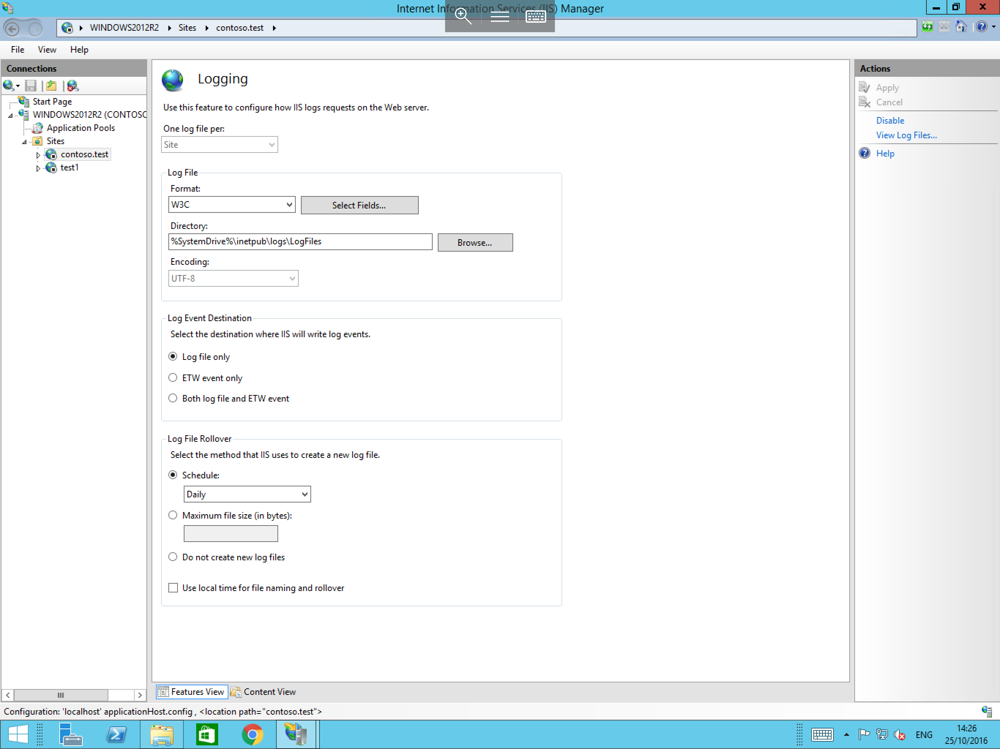

The `W3C Logging Fields` pane will now presented. In this pane, please select `Add Field` from the bottom of the pane as below.

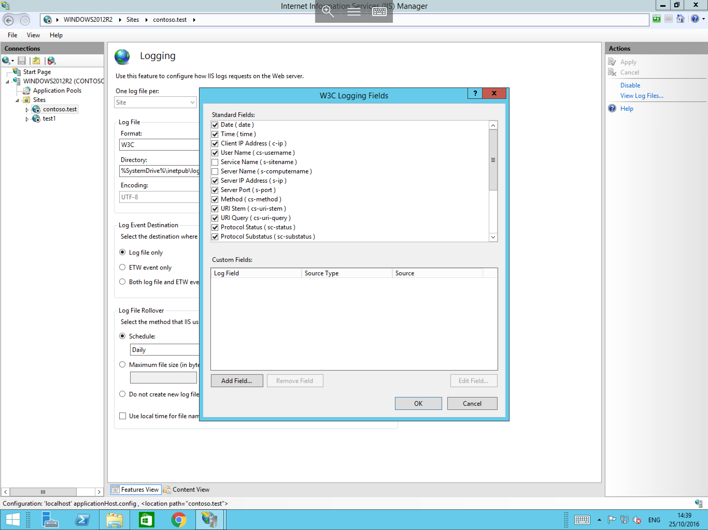

In the resulting `Add Custom Field` pane, enter the following:

- **Field Name**: Enter a name which can be used to identify the field in the log files for example `SourceIP`.
- **Source Type**: Select `Request Header`.
- **Source**: Select the box and type `X-FORWARDED-FOR`.

The `Add Custom Field` pane should now look as follows:

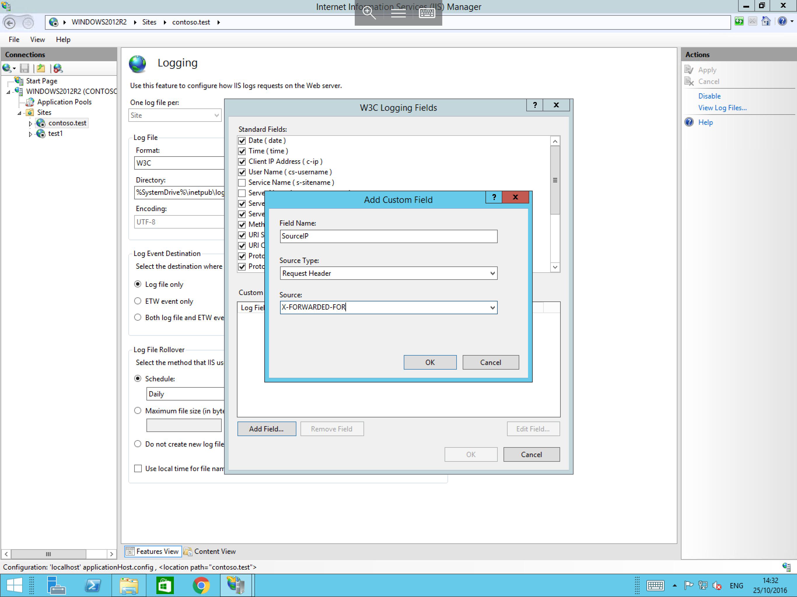

Now select `OK` and you will be returned to the `W3C Logging Fields` pane, where your new field should be visible as below. Select `OK` to complete the process.

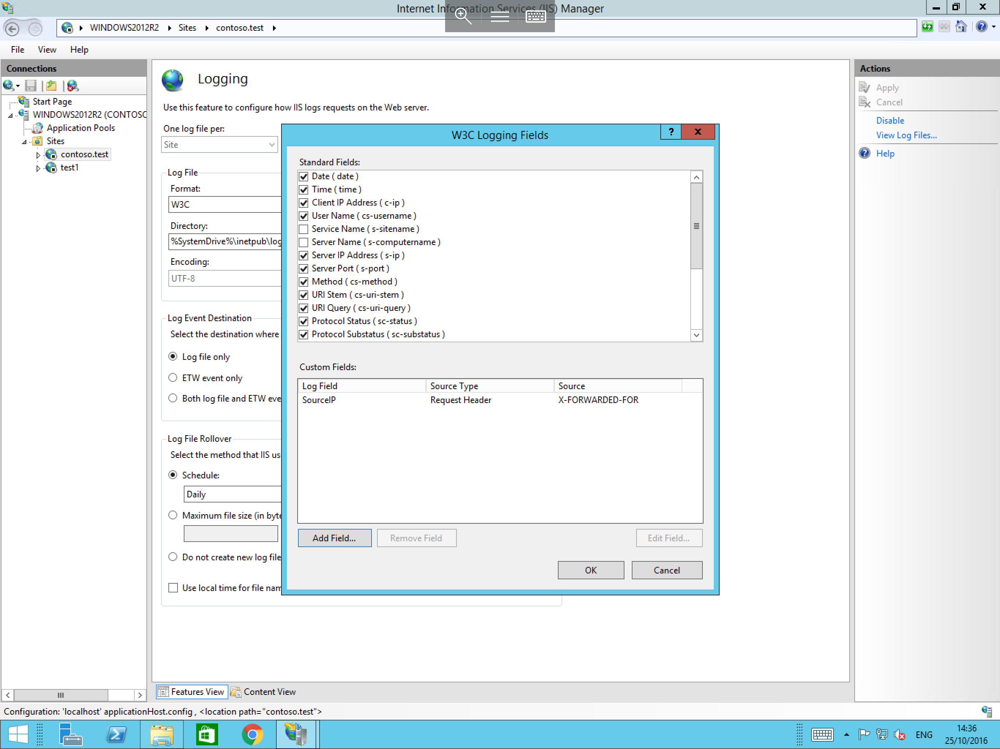

Further information and different functions of the IIS 8.5 Enhanced Logging module can be found at the link below:

- [IIS 8.5 Enhanced Logging](https://www.iis.net/learn/get-started/whats-new-in-iis-85/enhanced-logging-for-iis85)
