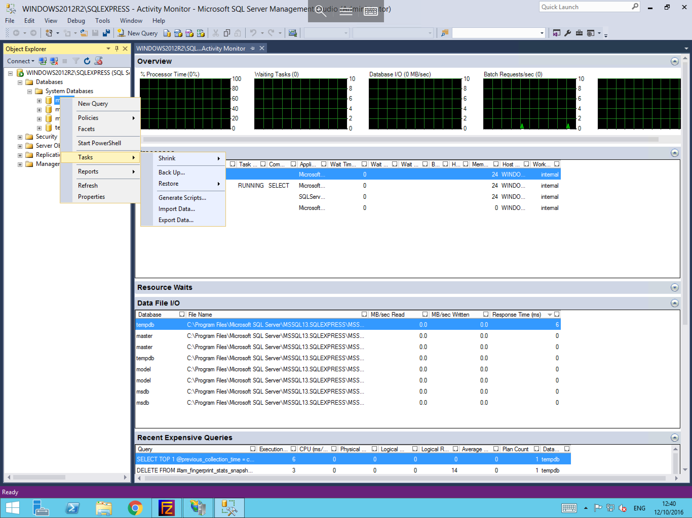
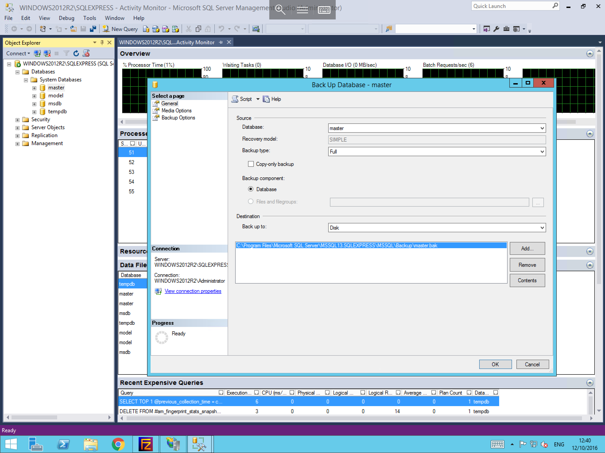
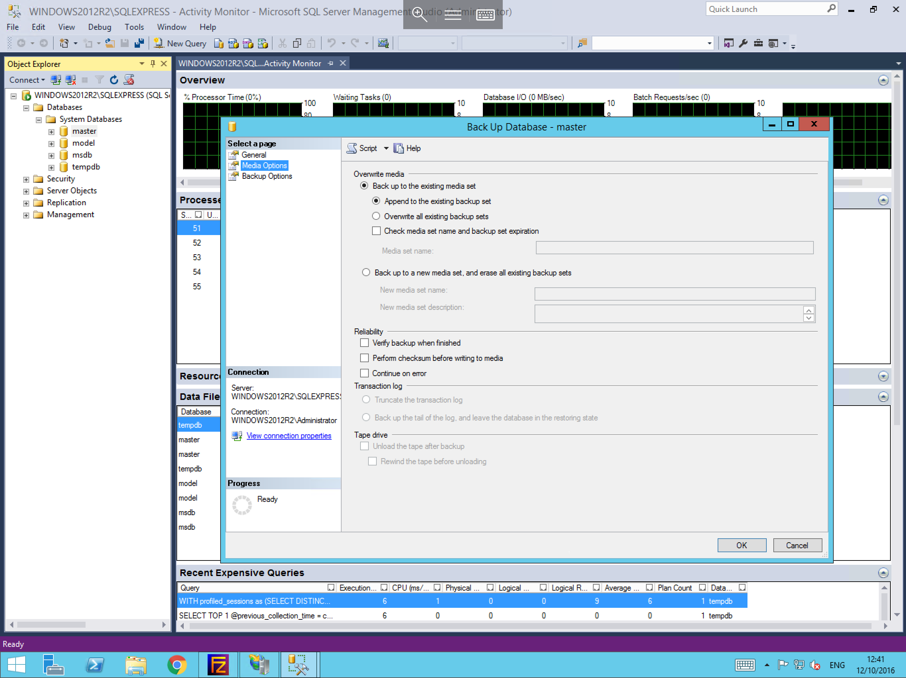
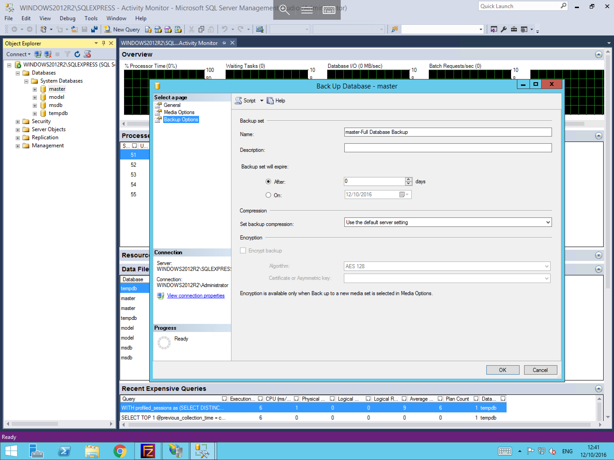

# Creating MSSQL backups

:::note
In order to create a backup of your database/s, please follow the below instructions, for the purposes of this guide, it is assumed that you are already logged in to your MSSQL instance.
:::

Please select the database which you wish to backup from within your MSSQL instance. Right click the database, select `Tasks`, and you will be able to see a `Back up` option, as below. Select this.

You will now be presented with the `Back Up Database` window. Within this window you will see at the top a `Source` section. Select the database that you wish to backup and choose the backup type which you wish to carry out.

Further down this window, you will see the `Destination` section. Select `Add`, and select the `...` button from the right hand side of the pane. Now choose the location where you would like the backup file to be placed and select `OK`. You will now be returned to the `Select Backup Destination` pane. Select `OK` again to confirm your selection.

The selection that you have chosen will now be displayed in the `Destination` field of the `Back Up Database` window as below.

From the left hand side of the `Back Up Database` window, within the `Select a Page` section, please select the `Media Options`. You will be presented with a number of options related to the behaviour of the backup such as whether to verify the backup or overwrite existing backup sets as below. Set the options which best suit your requirements. Once you have done so, select `Backup Options` from the `Select a Page` section.

The `Backup Options` window; which is shown below, allows you to set several secondary options such as a backup expiry date and if you would like for the database backup to be compressed to reduce its storage footprint. Configure these options and select `OK` to confirm your choices.

Your backup will now begin, and you will be presented with a confirmation once it has completed. You will now be able to retrieve the backup from the location which you specified while configuring the backup.
