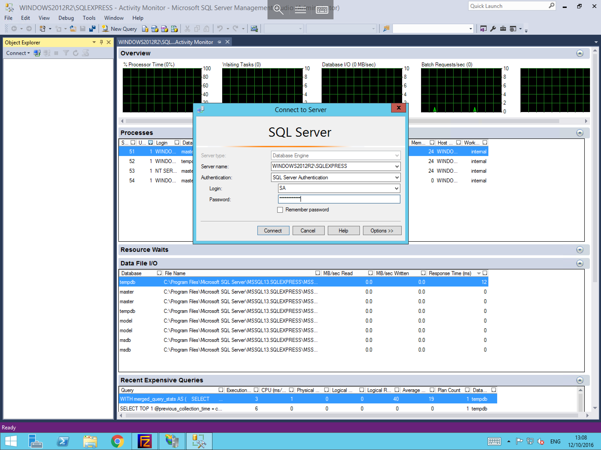
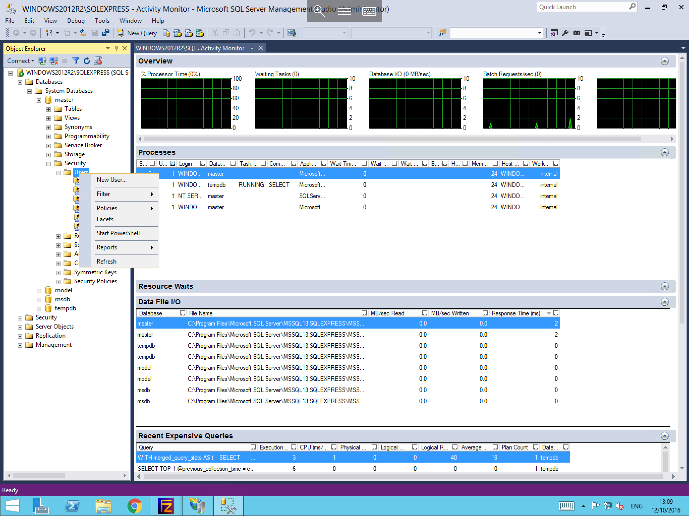
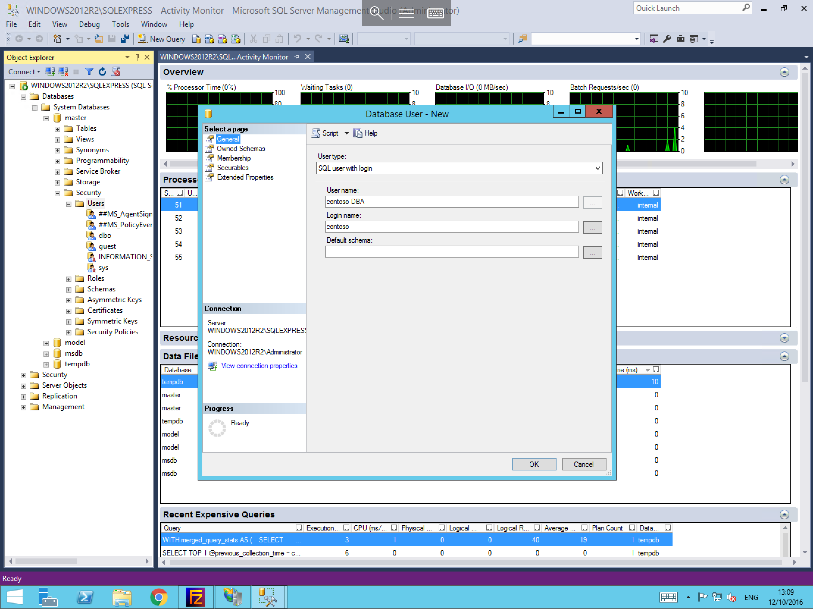
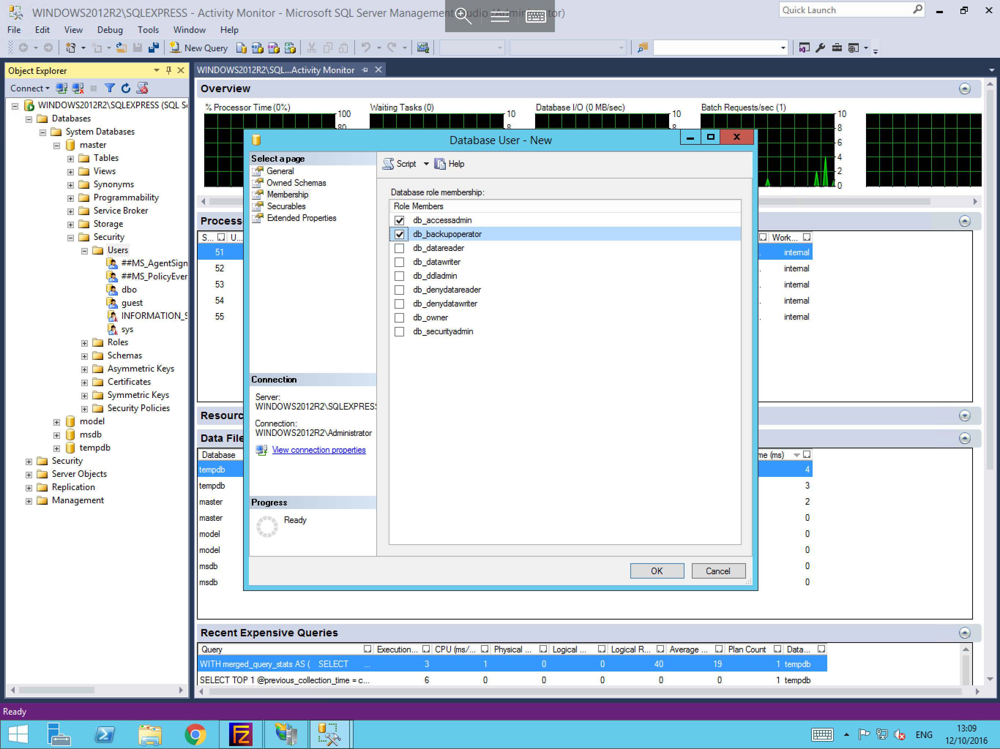

# How to create a Microsoft SQL Server database user

- In order to Create a Microsoft SQL Server database user, please follow the steps below.

:::note
For this guide, it is assumed that you have already created a database and that you have access to SA credentials or credentials with user creation privileges assigned to them.
:::

Firstly, please log in to `Microsoft SQL Management Studio` using your SA (or equivalent) credentials as below.

Once logged in, drop out the `Databases` section within `Object Explorer`, then drop out the database which you wish to create a new user for.

You will now see a number of folders appear under your database in the `Object Explorer`. Drop out the `Security` section, followed by the `Users` section.

A list of users will now be visible, right click on the `Users` object and select `New User` as below.

You will now be presented with the database `User` pane. Within this pane, you will see 5 pages under `Select a page` on the left hand side of the screen and by default you should be currently on the `General` page as below. Within this page, please set the `User Type`.

Several options are listed in the `User Type` selector which are self explanatory. However, for the purposes of this guide, we are going to use the `SQL user with login` option.

Enter a user name and a login name. The user name will be the displayed user name within your database and the login name will be used specifically for logging in to the SQL instance. Once you are happy with the details that you have entered select `Owned Schemas` from the `Select a page` menu on the left hand side of the pane.

On the `Owned Schemas` pane, you can select a variety of different schemas to assign this user to. An explanation of these schemas can be found at the link below. Once you have made your selection, select `Membership` from the `Select a page` menu on the left hand side of the pane.

- [MSSQL Schemas](<https://technet.microsoft.com/en-us/library/ms191451(v=sql.90).aspx>)

You will now be presented with the `Database role membership` selection pane as below. Within this pane you will need to select the appropriate roles for your user. This is entirely your own choice and should be set in accordance with what task the user will be carrying out.
For an explanation of the different roles and their functions, please visit the following link:

- [Database-level Roles](https://msdn.microsoft.com/en-GB/library/ms189121.aspx)

Once you are happy with your choices, please select `OK` to create your user. You will now be returned to the `MSSQL Management Studio` and you should be able to see your new user in the users list for your database as below.

