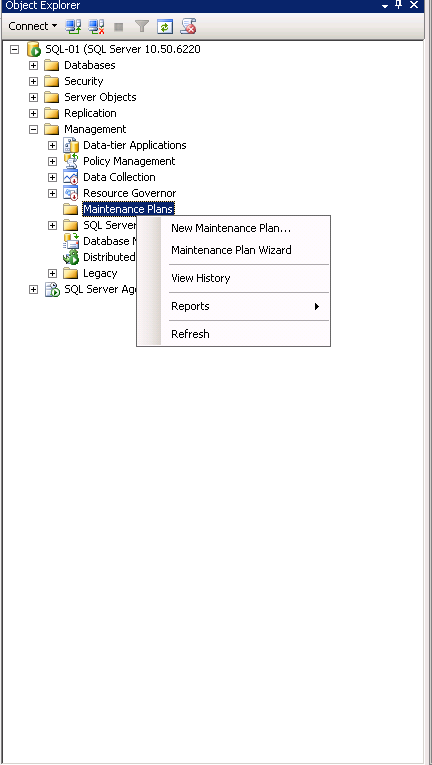
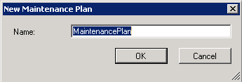
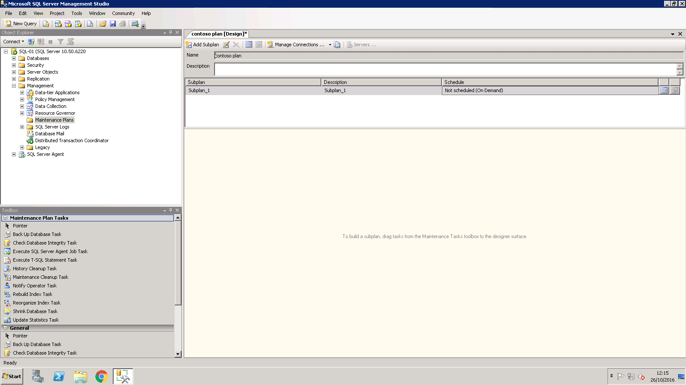
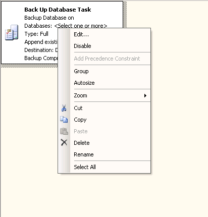
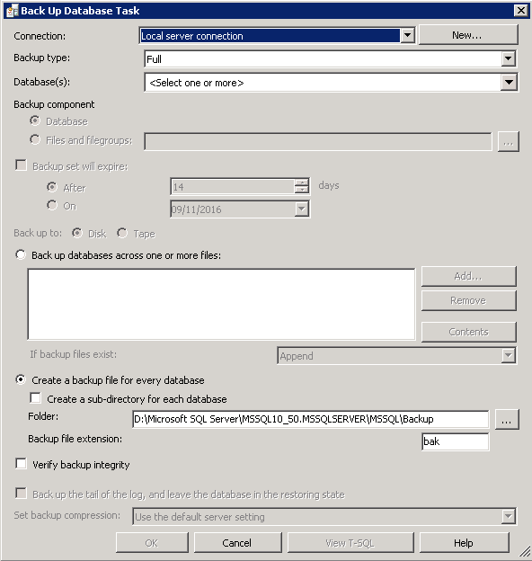
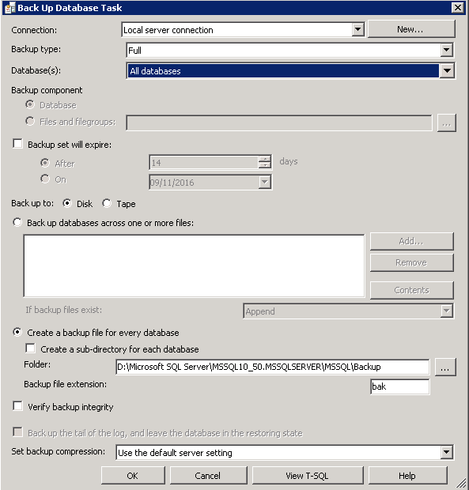
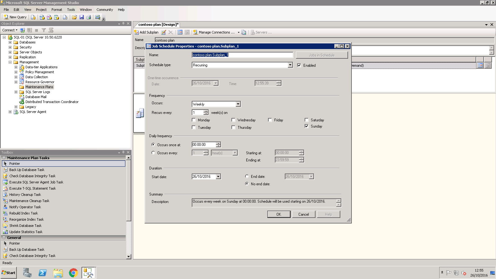

# Creating an MSSQL Maintenance Plan

Maintenance Plans are a form of task scheduling in MSSQL, they can be used to periodically carry out tasks such as database backups, rebuilding of indexes, database shrinking, etc.

:::note
This guide assumes that you already have a database instance which you are looking to configure maintenance plans on.
:::

To configure a maintenance plan, please follow the below steps.

Select `Start`. Now select `Microsoft SQL Server Management Studio` from the list of available applications. Once the management studio opens, log in to your database as normal.

Once logged in, please pop out the `Management` node within Object Explorer and right click `Maintenance Plans` as below:

From the context menu, select `New Maintenance Plan...`. You will now be presented with a new Maintenance Plan dialogue box. Enter a name for your new plan in the `Name` field as below, then select `OK`.

You will now be presented with the Maintenance Plan window as below. On the lower portion of the Object Explorer, you will see a section named `Toolbox`, within the toolbox section, you will see a number of different options.
These are the different maintenance tasks which can be carried out. For this demonstration, select `Back up Database Task`.

In the central view, you will now see an entry named `Back Up Database Task`. Right click the entry and select `Edit` from the resulting context menu as below:

The `Back Up Database Task` pane will now be displayed. This pane displays several options which you will need to configure to your requirements as below:

Once you have configured the options to your requirements as we have below, select `OK`.

You will now be returned to the Maintenance Plan window. From the `Sub plan` menu at the top of the central field, select the calendar icon. You will now be presented with the `Job Schedule Properties` window as below.
This window denotes how frequently your maintenance plan will run. Please configure this window to your requirements and select `OK`.

Your maintenance plan is now complete. To view a full list of possible tasks which you can carry out with the maintenance plan in MSSQL, please view the following link:

- [Maintenance Plans in MSSQL](https://msdn.microsoft.com/en-gb/library/hh710041.aspx)
