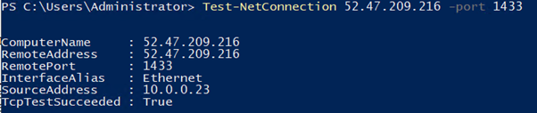
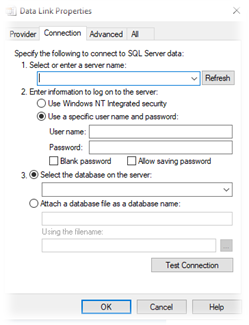
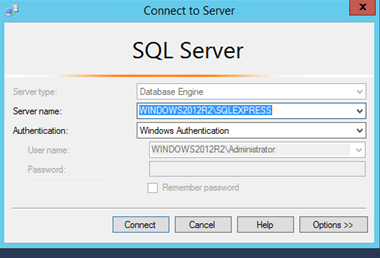

# MSSQL remote access

## Connecting to MSSQL Instance remotely

In order to connect to a MSSQL instance from a remote source, the following is required:

- Check the port on which MSSQL is currently listening. This is typically port `1433/tcp`.
- Outbound connectivity from the originating source to the destination server over the MSSQL port.
- Firewall rules to allow inbound connectivity over the MSSQL port.
- SQL Server Management Services (SSMS) to be installed on the remote client.

## How to check your servers MSSQL port

To check the port in which the SQL Server is configured to listen on, you would need to:

- Establish an RDP connection to the MSSQL server
- To open MSSQL Server Configuration manager
  - Click `Start`
  - Then `Microsoft SQL Server {Version}`
  - Then `SQL Server {Version} Configuration Manager`
- Expand `SQL Server Network Configuration`
  - Click `Protocols for MSSQLSERVER`
  - Right click `TCP/IP`
  - Then `Properties`
  - Then `IP Addresses`
  - Scroll down until you see your internal server IP and check `TCP port`


## Opening the MSSQL Ports on your firewall

Dependent upon on whether or not your server resides behind a dedicated or shared firewall, the following documentation will guide you through securely opening the MSSQL ports.

- [Dedicated Firewall](../../../../network/firewalls/dedi-lockdown/)
- [Shared Firewall](../../../../network/firewalls/shared-lockdown/)

## Troubleshooting connectivity to your MSSQL Server

To check if you're able to communicate from your workstation network over the required MSSQL port, you can use the `Test-NetConnection` PowerShell `cmdlet`:

```powershell
Test-Netconnection {RemoteServerAddress} -port {MSSQLPORT}
```

Please note, the `TcpTestSucceeded` message indicates if the port is accessible.

### Example



To further test connectivity to your instance, the following method can be used:

On your remote client:

- Go to `Start` > `Notepad.exe` > `File` > `Save As`
- Enter the filename as `ConnectionTest.udl`
- Set `Save As type` to `All Files (*.*)`



Open the UDL file and enter the following information:

| Name                                  | Value                                      |
| ------------------------------------- | ------------------------------------------ |
| **Server name**                       | The server IP                              |
| **Use a specific username...**        | Enter the SQL Server Credentials           |
| **Select the database on the server** | Select hte DB you would like to connect to |

Then click `Test Connection`.

## Installing SSMS and connecting to your instance

The latest SSMS client can be downloaded [here](https://docs.microsoft.com/en-us/sql/ssms/download-sql-server-management-studio-ssms?view=sql-server-ver15).



In order to connect to the instance, you will need to enter the correct connection details in to the `Connect to Server` pane, as demonstrated above.

Please note that Windows Authentication may not be enabled on your instance. If this is the case, you will need to use the `sa` credentials to authenticate instead. In order to do this, you simply need to select the arrow next to the `Authentication` field, select `SQL Server Authentication`, then enter your `sa` credentials in the username and password fields below.
