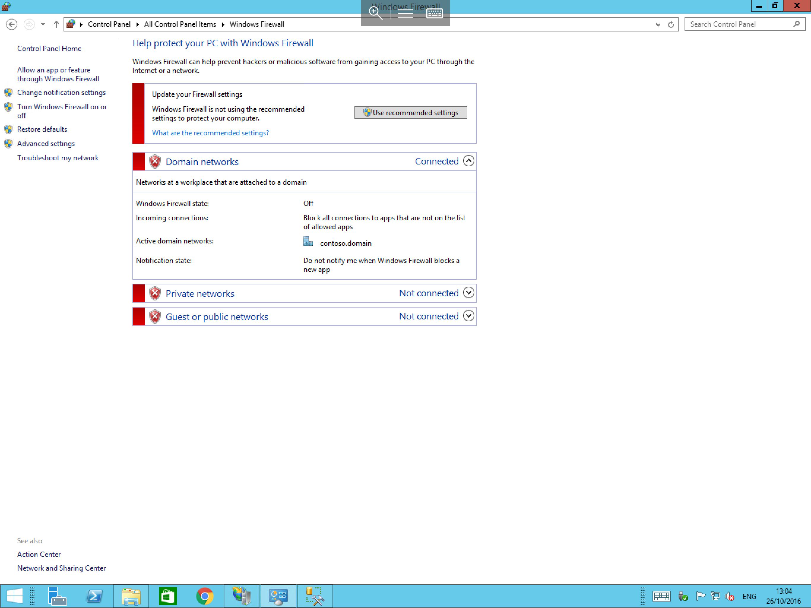
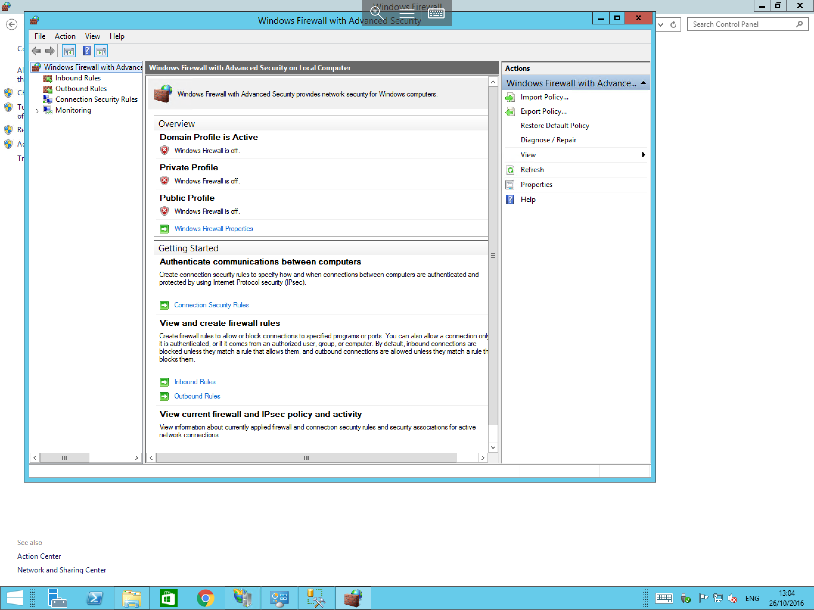

# Windows Firewall

## Creating rules

Windows Firewall can be used alongside your network based hardware firewall to offer an extra layer of security. In order to create rules in Windows Firewall, follow the below guide.

Select `Start`, then select `Control Panel` from the list of available icons. Once the Control Panel has loaded, select `Windows Firewall`. You will now be presented with the Windows Firewall configuration window as below:

Select `Advanced Settings` from the left hand side of the window. You will now be presented with the `Windows Firewall with Advanced Security` window as below:

Select the `Inbound Rules` item from the available options on the left hand side of the window, now select `New Rule...` from the actions pane on the right hand side of the window.

The `New Inbound Rule Wizard` will now be displayed as below. The first pane of the wizard asks you choose the type of rule which you want to create. Select `Port` then select `Next`.

The next pane asks you to choose the `Protocol and Ports` which you wish to configure the rule for as below. Choose `TCP` and select `Specific local ports`. Once you have selected those options, please enter `3399` in the `Specific local ports` field and select `Next`.

You will now be asked to specify the action which you wish the rule to carry out. In this instance, select `Allow the connection` as below and select `Next`.

The next pane is the `Profile` pane. In this pane, you will need to select on which type of connection does the rule apply i.e from a public or private network connection, for this demonstration, please select all 3 options as below:

The final pane asks you to provide a name and a description for your rule. Enter an appropriate name; in this case "Alt RDP port" as below and select `Finish`.

You will now be returned to the `Advanced Firewall` menu where the list of inbound rules will be displayed. Now included in the list is your newly created rule as below.

The process for creating an outbound rule is identical to the above guide, you simply select `Outbound rules` from the left hand menu of the advanced firewall screen.

## Enabling and disabling rules

The process to enable and disable rules in Windows Firewall is extremely simple; to do so:

- Select `Start`, then select `Control Panel`. Once Control Panel has launched, select `Windows Firewall`.
- Now select `Advanced Settings` from the left hand side of the windows firewall pane.
- You will now be presented with the `Advanced firewall options`, select the type of rule that you wish to enable or disable (Inbound rule or outbound rule).
- Locate the rule you are looking for in the list and right click on it.
- Select `Disable Rule` or `Enable Rule` as appropriate from the resulting context menu as below.

## Enabling or disabling Windows Firewall

In order to enable or disable Windows Firewall, please follow the simple steps below.

Select `Start`, and then `Control Panel`. Once Control Panel has launched, select `Windows Firewall`, you will now be presented with the windows firewall pane as below:

Select `Turn Windows Firewall on or off` from the left hand menu.

:::note
Your user account will need administrator privileges to do the above.
:::

You will now be presented with a window titled `Customise settings for each type of network` as below. Please select the appropriate setting which suits your needs.

