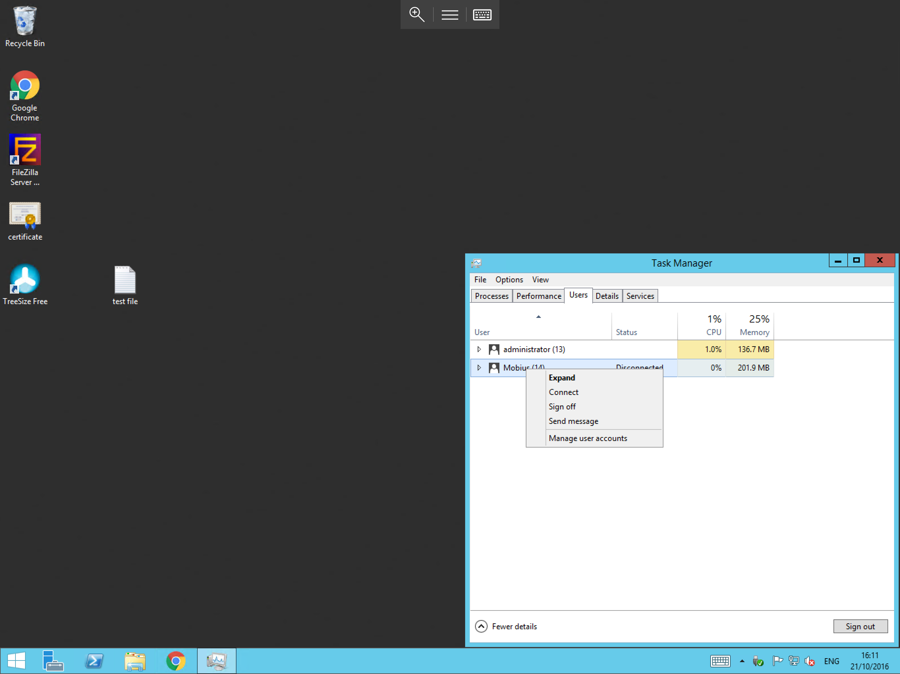

# Managing Remote Desktop sessions

If ever you need to know which users are logged into your server(s) you can view this information using `Windows Task Manager`.

To view currently logged in users, please follow the below steps.

Right click the taskbar and select `Task Manager`. You will now be presented with the Task Manager pane. Within the pane, select `Users` from the available tabs.
You will now be able to view a list of currently connected users as below. Right clicking on any particular user reveals a number of options which are explained below. You can also pop out the arrow next to each user to view which processes they are currently using.

:::note
The available options, will depend on the current status of each user, i.e Active, Disconnected, etc.
:::

- **Send Message** - Allows you to type a message to this user which will display on their desktop once sent.
- **Connect** - Take over this user's session. If the user is a different account to the one you're logged in with you will be prompted for the new users credentials.
- **Disconnect** - Disconnect the user's session. This will leave all of their applications/documents open but will force the user's remote desktop session to close on their screen.
- **Sign Off** - Disconnects the user's session, closes all open applications/documents and logs the user off.
- **Remote Control** - Allows you to share a remote desktop session with this user. The user will be prompted to accept your request before sharing begins.
