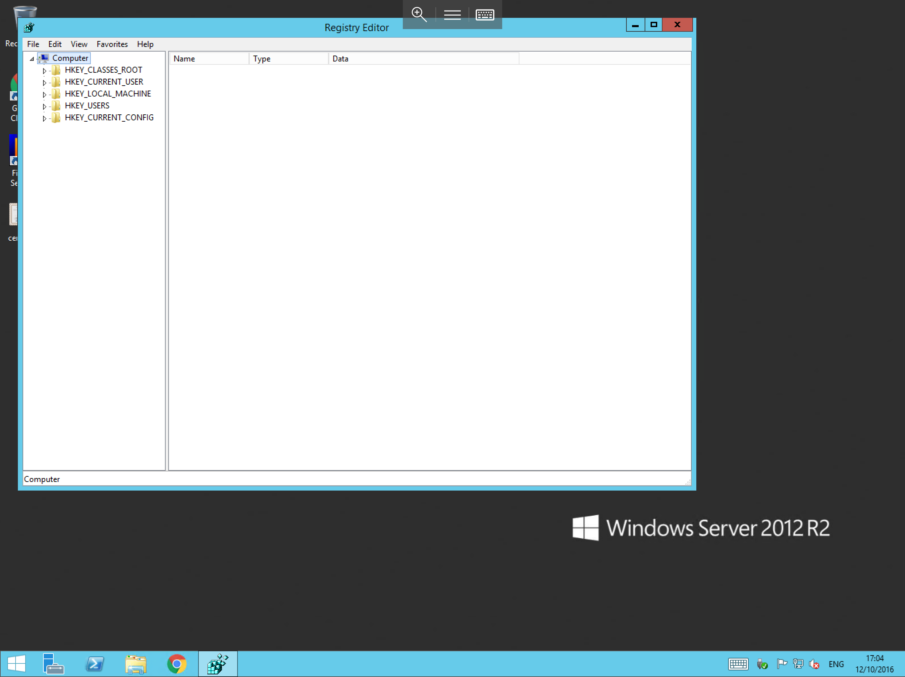
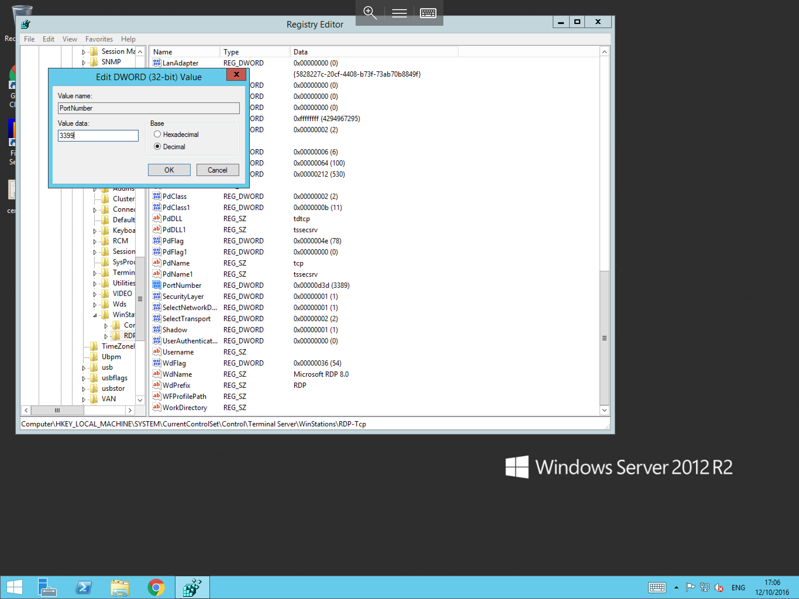
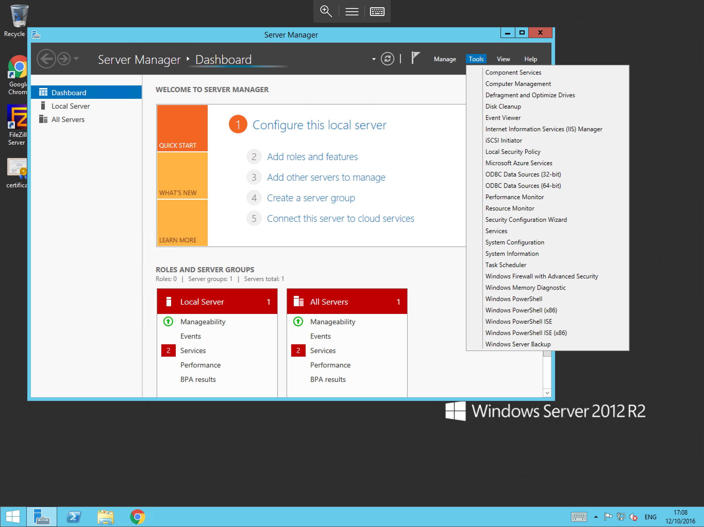
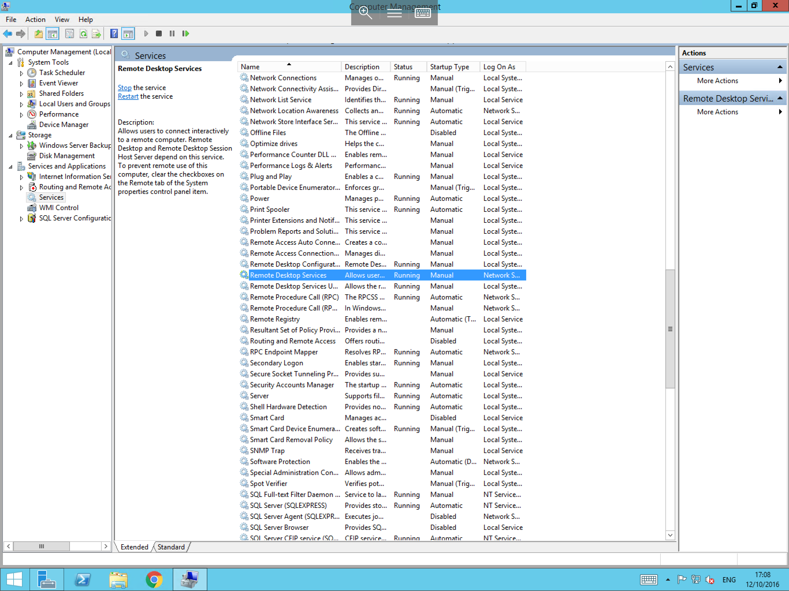
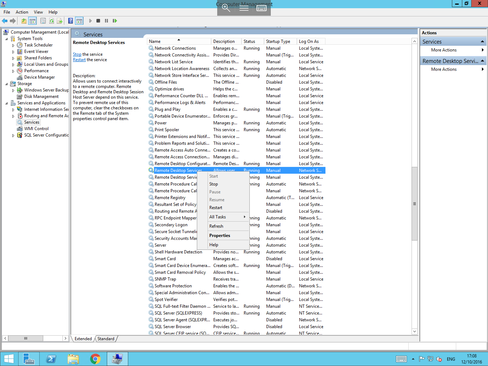
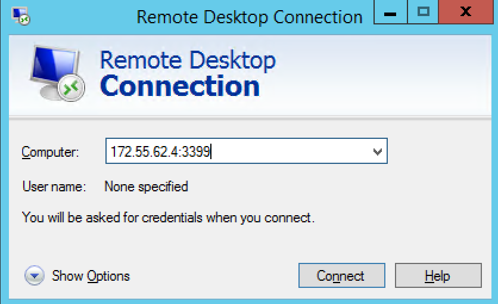

# How to change the Remote Desktop port

The Remote Desktop port may be changed for security reasons. If you look in the Security Log in Event Viewer, you may notice events with ID 4625. These are created when there are failed logins for a generic username, such as Administrator. If you notice a large volume of these entries in the Security Log, this may be indicative of a brute force attack to the Remote Desktop service on your server.

One of the ways to mitigate this is to change the listening port from the default port of `3389/tcp`

:::note
An important part of this process is to ensure that the new port is first opened on the firewall. If it is not open, you will not be able to connect via RDP once the change has been made.
:::

In order to change the RDP port, you will first need to access the Registry Editor. Please select `Start`, and type `regedit`. Select the `regedit` application from the list, as below:


You will now be presented with the `Registry Editor` as below. Navigate through the hive until you reach this path:

```none
HKEY_LOCAL_MACHINE\System\CurrentControlSet\Control\TerminalServer\WinStations\RDP-Tcp
```



Now select the `RDP-Tcp` node, and you will see a number of registry keys in the centre field. Scroll through these keys until you find `PortNumber`. Right click the `PortNumber` key, and select `Modify`. You will now be presented with the `Edit DWORD (32-bit) Value` dialog, as below:



Select the radio button next to `Decimal` in the base section, then in the `Value Data` field, enter the new port which you would like to use for `Remote Desktop Services`. Click `OK` and close the Registry Editor.

Now that you have changed the RDP port, you will need to reset the `Remote Desktop Services` service. To do that, follow the steps below:

Open `Server Manager`. This can be done by either selecting the `Server Manager` icon on the Taskbar, or by selecting `Start`, and selecting `Server Manager` from the list of available applications.

Select `Tools`, then select `Computer Management`, as below:



You will now be presented with the `Computer Management` console, select `Services and Applications` and then select the `Services` option.
The centre view will now be populated with the services which run on your server. Scroll down the list and select `Remote Desktop Services`, as below:



Right click on `Remote Desktop Services` and select `Restart` from the context menu.



At this point all `Remote Desktop` sessions to the server will be terminated while the service restarts. Once the service has finished restarting, you will be able to form your new connection by adding the new port number to the connection string, as demonstrated below:



If you have followed all of the above steps correctly, you should now be logged back in to your server. If you are experiencing trouble connecting to your server after this point, please confirm that you have allowed the new port in your firewall configuration. If you are still not able to connect, raise a PSS ticket with ANS Support to have the issue investigated.
