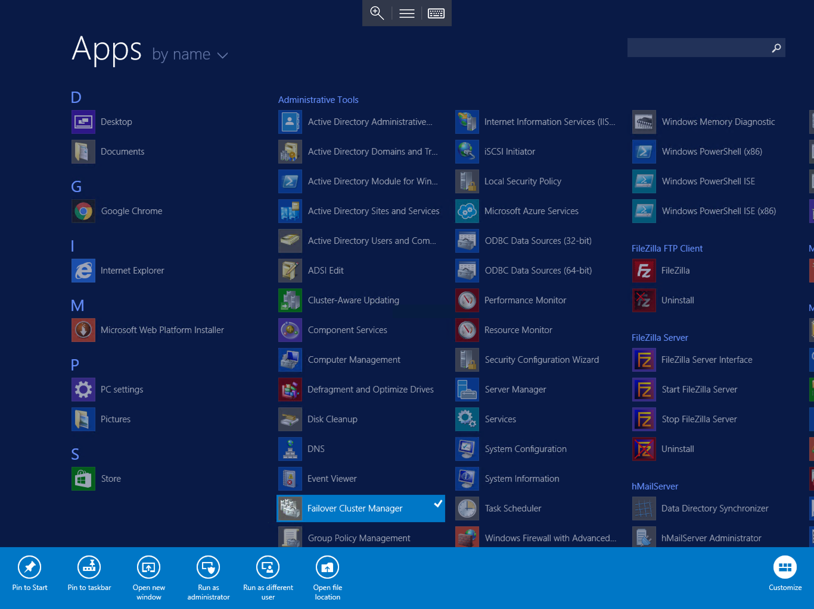
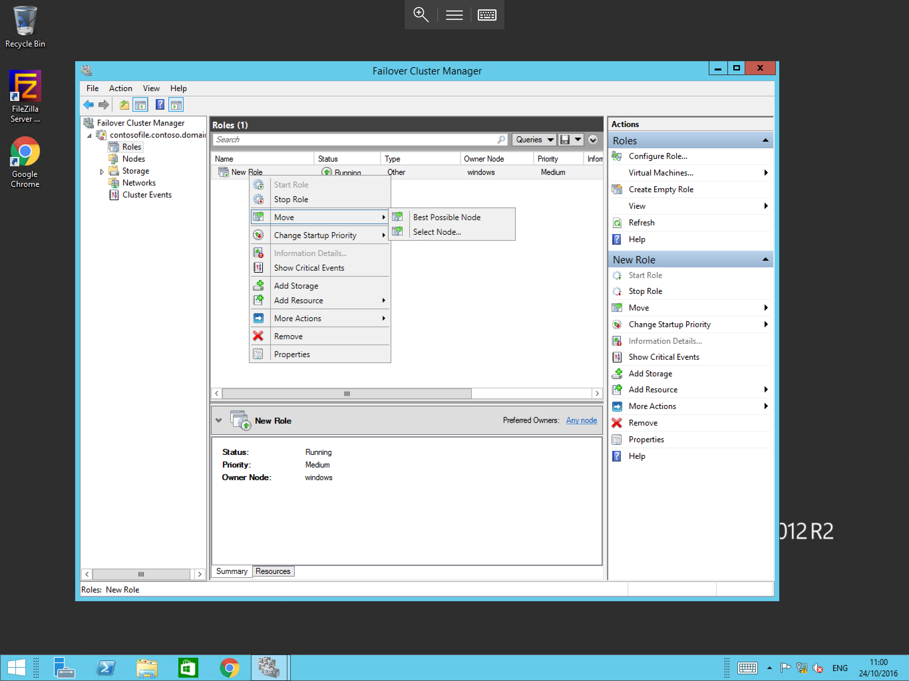

# Checking Windows cluster status

Windows Server uses a tool known as Failover Cluster Manager to create highly-available services. These range from file-shares all the way through to multi-tenant MSSQL Clusters. Failover Cluster Manager makes the management of the components for these services easy and provides great visibility of your services.

## Which of my hosts are active?

To check which node in your cluster is currently active, please follow the below steps.

:::note
This guide assumes that you have already logged in to your cluster using the cluster IP.
:::

Select `Start`, then select `Failover Cluster Manager` from the list of available programs as below.

You will now be presented with the `Failover Cluster Manager` as below. From this pane you are able to view information on your cluster and carry out any administrative tasks.

From the left hand pane, select the cluster (This will be the name which you have configured for your cluster, in this example it is name `contosofile.contoso.domain`). Expand the cluster menu, using the pop out arrow to the left of the cluster name. This will present the various options which are available to you.

You will now be able to see 5 menu items below the cluster name which you have expanded, please select the "Roles" option from the menu.
The central pane will now display information on all of the available nodes within your cluster, each service will display, status, type, and owner node as below.

## Failover a clustered service

If you have followed the above guide to view the cluster service status, then you will already be viewing the required location which you will need for this section of the guide.
If not, please follow the above section of this guide before proceeding with this section.

Please select `Roles` from the left hand pane of the failover cluster manager. From the central view, right click the role which corresponds to the clustered service which you wish to failover. Select `Move` from the resultant context menu, then select the desired node which you would like to move the service to. Alternatively, select `Best Possible Node`, as below:

:::note
During failover, any active connections to the server will be disconnected for a short period whilst these services stop on one host and start on another.
:::
