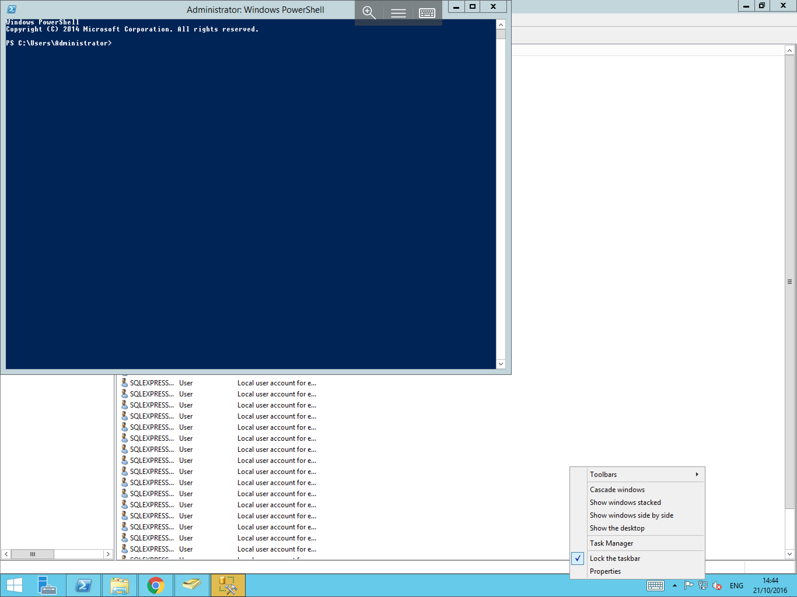
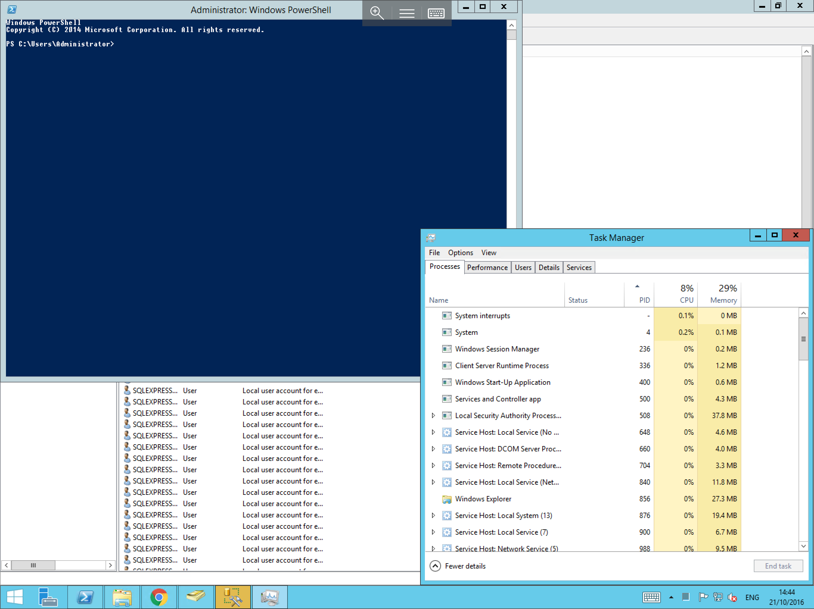
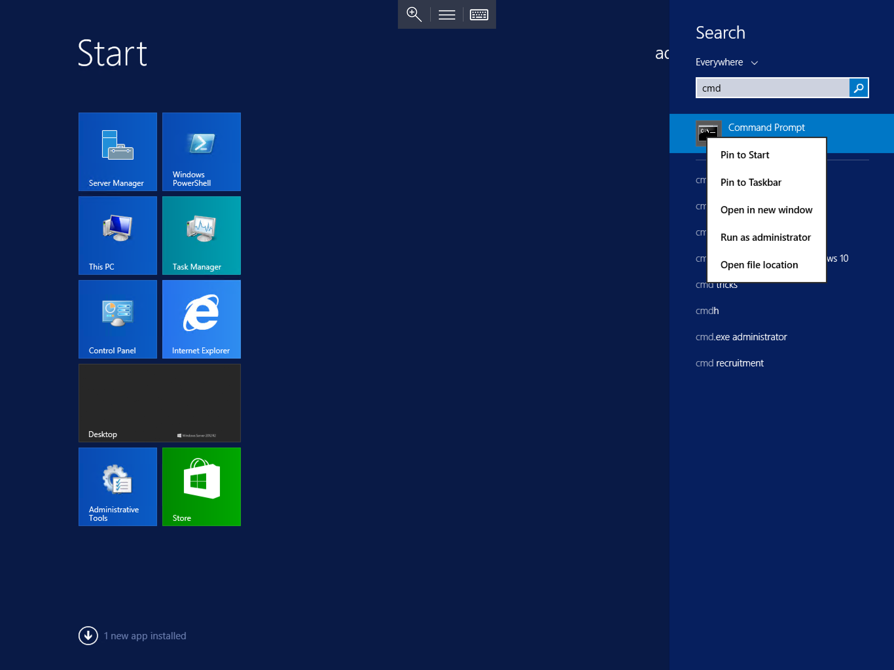
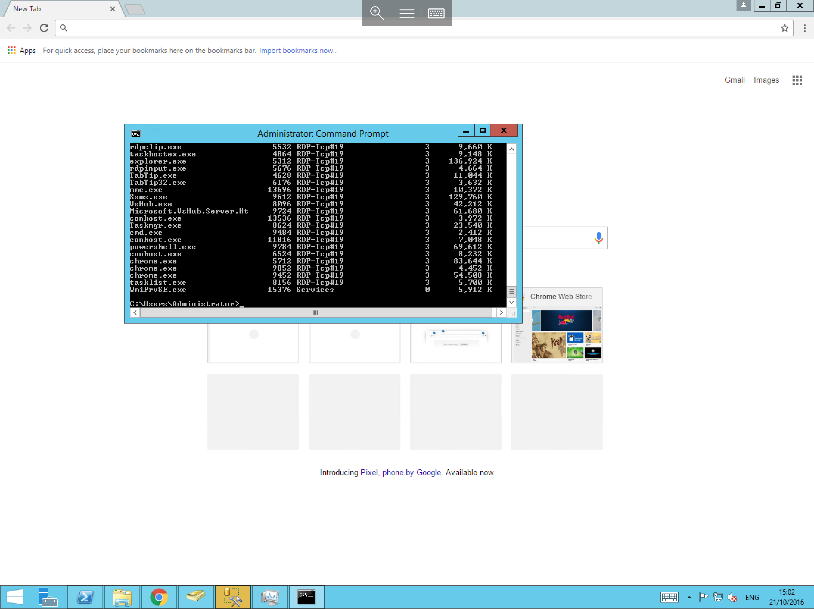
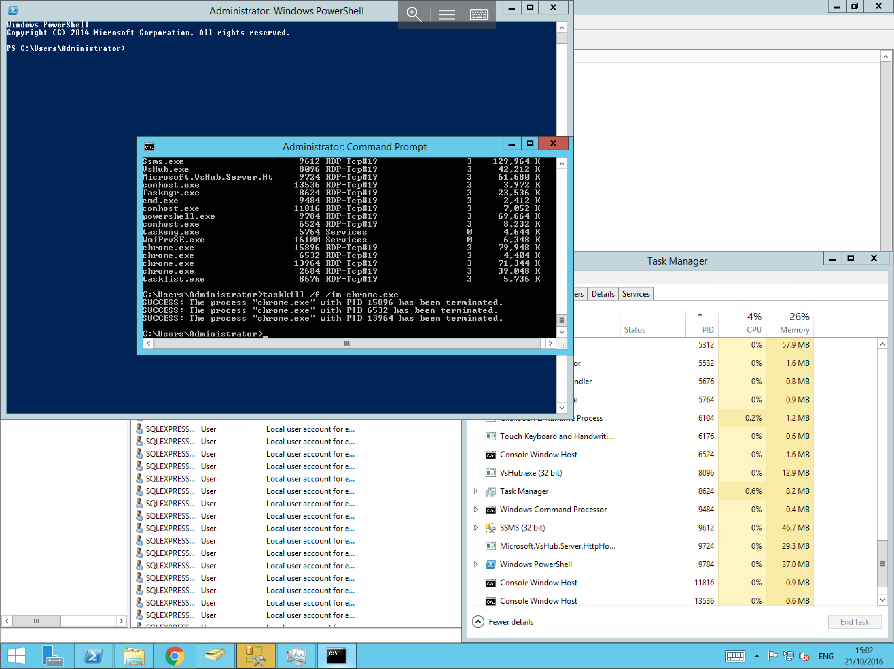

# How to forcibly end a process in Windows

In some instances applications and processes can become unresponsive and require manual intervention to forcibly end the process.

In order to forcibly end a process, you have two methods available to you.

## End a process using Task Manager

To forcibly end a process using Task Manager, right click on the `Start` menu, and select `Task Manager` as below:

You will now be presented with the `Task Manager`. Select the `Processes` tab from the top line as below:

Scroll down the list until you find the process which you wish to end. Right click the process and select `End task` as below:

## End a process using the `tasklist` and `taskkill` commands

To forcibly end a process using the command line, select the `Start` menu, and type `cmd`, right click the resultant `cmd.exe` and select `Run as administrator` as below:

In the Command Prompt, type `tasklist` and press `Enter`. This will display a list of running processes, as below. Locate the process which you wish to end in the list and make a note of the name or the PID.

Now in the command line, type either `taskkill /f /im <process name>` and press `Enter` to end a process by its name, or `taskkill /f /PID <number of pid>` and press `Enter` to end a process by its PID.

For example (By Name) `taskkill /f /im chrome.exe` as below or (By PID) `taskkill /f /PID 15896`

For the full command line syntax of `tasklist` and `taskkill`, please visit the respective link below:

- [Tasklist](https://technet.microsoft.com/en-us/library/bb491010.aspx)

- [Taskkill](https://technet.microsoft.com/en-us/library/bb491009.aspx)
